# Zig 构建系统指南

## 为什么写这本书？

系统级编程中的构建流程通常比较繁琐：
- C/C++ 依赖 Autotools、Make、CMake 等工具，跨平台配置和交叉编译环境搭建成本较高；
- 现代语言（如 Rust Cargo、Go）统一了语言内的包管理，但遇到 C/C++ 依赖混编、代码生成或交叉编译时，仍需通过 `build.rs` 或 CGo 脚本调用外部工具链。

Zig 提供了另一种思路：
1. **直接用 Zig 编写构建逻辑（No DSL, Just Zig）**：不再引入专用的构建脚本语言，构建逻辑直接在 `build.zig` 中使用标准 Zig 编写；
2. **自包含工具链**：Zig 单体二进制内嵌了 Clang 编译器、LLD 链接器以及主流平台的 libc 符号库，无需额外安装目标平台的外部交叉编译环境；
3. **有向无环图（DAG）模型**：构建脚本负责在内存中声明依赖任务图，由多线程调度引擎执行并结合哈希指纹做增量缓存；
4. **编译单元与产物解耦**：通过 `std.Build.Module` 与 `std.Build.Step.Compile` 的分工，模块配置可以在静态库、动态库与测试目标间复用。

由于 Zig 处于快速迭代期，网络上较多旧版本（0.11、0.12 等）的代码片段已无法直接使用。本书梳理 Zig 构建系统的核心抽象、常用 API 以及底层执行机制，帮助读者掌握基于现代 Zig 的构建实践。

> 🌐 网站：<https://jiacai2050.github.io/zig-build-0.16/>

---

## 本书内容组织

全书分为五个主题与附录：

1. **来龙去脉与设计哲学**（`philosophy/`）
   - 梳理构建工具的演进过程与痛点；
   - 介绍 Zig 构建系统的设计哲学与自包含工具链。
2. **核心概念深度解析**（`concepts/`）
   - 配置期（Configuration）与执行期（Execution）生命周期；
   - 任务计算图抽象：`std.Build.Step` 与 DAG 拓扑；
   - 模块与产物解耦：`Module` vs `Step.Compile`；
   - 惰性路径：`LazyPath` 的设计与依赖推导；
   - 包管理模型：`build.zig.zon` 与 `.zig-cache` 缓存布局。
3. **核心 API 全景与实战用法**（`api/`）
   - 编译选项解析与顶层 Step 注册；
   - 可执行文件、库与单元测试产物构建；
   - 模块命名空间管理与子模块导入（`addImport`）；
   - C/C++ 互操作、头文件包含路径传播与头文件树导出；
   - 模板替换（`addConfigHeader`）与文件动态生成；
   - 依赖包消费（`b.dependency`）与自定义 Step 开发。
4. **源码级底层运行机制**（`internals/`）
   - Build Runner 的动态编译与调度流程；
   - `Step.Compile.make()` 拼装底层 CLI 命令细节；
   - 单体编译单元 ZCU 与跨模块 comptime 分析机制；
   - 内置 Clang 前端 C++ FFI 桥接（`ZigClang_main`）与链接器合并机制。
5. **实战工程最佳实践**（`practices/`）
   - 纯 Zig 应用程序工程范式；
   - Zig 与 C/C++ 混合编程结构；
   - 复杂第三方 C 库的移植实践（以 MariaDB Connector/C 为例）；
   - 跨平台交叉编译与 GitHub Actions CI 流水线。
6. **附录**（`appendix/`）
   - `std.Build` 常用 API 速查表。

---

## 环境与代码约定

- **Zig 版本**：基于 **Zig 0.16.0**。0.17 的版本见[这里](https://jiacai2050.github.io/x/zig-build/)。
- **实战示例代码**：
  本书配套了 5 个完全独立的 Zig 0.16.0 示例工程，源码均位于项目的 `examples/` 目录，读者可直接点击链接浏览源码或在本地运行：
  | 示例项目 | 核心验证场景 | 对应章节 |
  | :--- | :--- | :--- |
  | [examples/01-zig-app](https://github.com/jiacai2050/x/tree/main/zig-build/examples/01-zig-app) | 标准 Zig CLI 应用、模块拆分与单元测试 | [实战一：标准 Zig CLI 应用与单元测试](practices/practice-zig-app.md) |
  | [examples/02-mixed-c-zig](https://github.com/jiacai2050/x/tree/main/zig-build/examples/02-mixed-c-zig) | Zig 与 C 混合编译、头文件自动转译 | [实战二：Zig 与 C/C++ 混合编程工程结构](practices/practice-mixed-c-zig.md) |
  | [examples/03-code-generation](https://github.com/jiacai2050/x/tree/main/zig-build/examples/03-code-generation) | CMake 风格配置头文件与动态代码生成 | [动态生成与模板配置：addConfigHeader 与 addWriteFiles](api/code-generation-api.md) |
  | [examples/04-c-library-port](https://github.com/jiacai2050/x/tree/main/zig-build/examples/04-c-library-port) | 复杂第三方 C 静态库封装与导出 | [实战三：复杂第三方 C 库的完整移植实践](practices/practice-porting-c-library.md) |
  | [examples/05-custom-step](https://github.com/jiacai2050/x/tree/main/zig-build/examples/05-custom-step) | 编写自定义打包 Step 接入构建 DAG | [编写自定义 Step：扩展构建管线](api/custom-steps.md) |

  复杂 C 库移植工程参考开源项目 [zig-mariadb-connector](https://github.com/jiacai2050/zig-mariadb-connector)；源码分析基于 [Zig 官方 0.16.0 源码树](https://codeberg.org/ziglang/zig/src/tag/0.16.0)。
- **代码注释**：示例代码中的注释均使用英文，正文采用中文叙述。

---

## 勘误与反馈

书中的所有代码均经过了本地与 CI 测试，并利用 AI 润色，但 AI 存在幻觉，再加上 Zig 及其构建系统演进较快，个人精力与水平有限，书中难免会有疏漏或理解偏差。

如果你在阅读或实战中发现任何错误（代码无法运行、原理解释有误、文字错漏等），欢迎反馈与交流：
- 在 GitHub 提交 Issue 或 PR：<https://github.com/jiacai2050/zig-build-0.16>
- 加入 [ZigCC 微信群](https://github.com/orgs/zigcc/discussions/134)，与更多人一起讨论、交流 Zig
