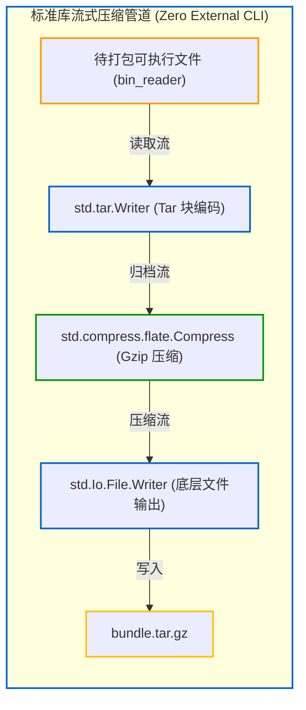
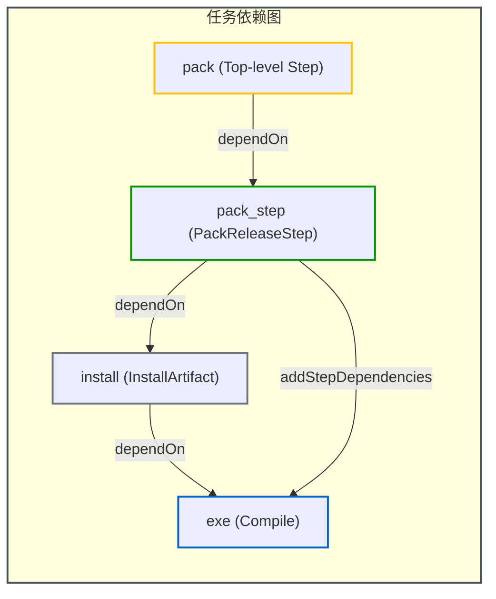

# 编写自定义 Step：扩展构建管线

当内置的 Step（如编译、运行、代码生成等）无法满足特定任务（如打包归档、校验签名、格式化非代码文件等）时，可以通过实现 `std.Build.Step.makeFn` 编写自定义 Step。

> 💡 **配套可运行示例**
> 本章对应的纯 Zig 标准库打包 Step 完整工程代码位于 GitHub：[`examples/05-custom-step`](https://github.com/jiacai2050/x/tree/main/zig-build/examples/05-custom-step)。
> 你可以进入该目录并通过以下命令体验纯标准库归档打包与运行：
> ```bash
> cd examples/05-custom-step
> zig build pack
> zig build run
> ```

---

## 1. Step 的基本结构

实现自定义 Step 需满足两个核心条件：
1. **持有 Step 实例**：结构体中必须包含一个 `std.Build.Step` 字段；
2. **提供 `makeFn` 回调**：提供符合签名的执行函数：
   ```zig
   fn make(step: *std.Build.Step, options: std.Build.Step.MakeOptions) anyerror!void
   ```

在 `make` 函数中，通过 `@fieldParentPtr` 从 `*std.Build.Step` 安全地反向推导出宿主结构体指针，从而访问自定义字段与配置数据。

---

## 2. 方式一：纯 Zig 标准库实现（以 `std.tar` + `std.compress` 为例）

很多开发者误以为打包压缩必须依赖外部系统的 `tar` 或 `zip` 命令。实际上，Zig 标准库原生提供了流式归档与压缩组件：
- **`std.tar.Writer`**：负责 Tar 协议头部构建、块填充（512 字节对齐）与数据流序列化；
- **`std.compress.flate.Compress`**：提供 Deflate/Gzip 压缩流；
- **`std.Io.File.Writer` / `std.Io.File.Reader`**：统一的跨平台文件 I/O 抽象。

### 流式管道架构



### 完整实现代码

下面是 [`examples/05-custom-step`](https://github.com/jiacai2050/x/tree/main/zig-build/examples/05-custom-step) 中完全自包含、无任何外部工具链依赖的 `PackReleaseStep`：

```zig
const std = @import("std");

pub const PackReleaseStep = struct {
    step: std.Build.Step,
    binary_path: std.Build.LazyPath,
    output_path: []const u8,

    pub fn create(b: *std.Build, binary_path: std.Build.LazyPath, output_path: []const u8) *PackReleaseStep {
        // 1. 使用构建系统的内存分配器分配自定义 Step 实例
        const self = b.allocator.create(PackReleaseStep) catch @panic("OOM");
        self.* = .{
            // 2. 初始化底层 Step
            .step = std.Build.Step.init(.{
                .id = .custom,
                .name = "pack-release",
                .owner = b,
                .makeFn = make,
            }),
            .binary_path = binary_path,
            .output_path = output_path,
        };
        // 3. 将产物所在的 Step 自动挂载为当前 Step 的前置依赖
        binary_path.addStepDependencies(&self.step);
        return self;
    }

    // 4. 执行期逻辑：只有当该 Step 被调度时才会触发
    fn make(step: *std.Build.Step, options: std.Build.Step.MakeOptions) anyerror!void {
        _ = options;
        const self: *PackReleaseStep = @fieldParentPtr("step", step);
        const b = step.owner;
        const io = b.graph.io;

        std.debug.print("Packaging release archive to {s} using std.tar + gzip...\n", .{self.output_path});

        // 1. 创建目标输出文件（若输出目录尚未存在则先行创建）
        const cwd = std.Io.Dir.cwd();
        if (std.fs.path.dirname(self.output_path)) |dir| {
            cwd.createDirPath(io, dir) catch {};
        }
        const tar_file = try cwd.createFile(io, self.output_path, .{});
        defer tar_file.close(io);

        // 2. 初始化底层文件写入缓冲流
        var write_buffer: [4096]u8 = undefined;
        var file_writer = std.Io.File.Writer.initStreaming(tar_file, io, &write_buffer);

        // 3. 在文件写入流外层套上 gzip 压缩器
        var compress_buffer: [std.compress.flate.max_window_len]u8 = undefined;
        var compressor = try std.compress.flate.Compress.init(
            &file_writer.interface,
            &compress_buffer,
            .gzip,
            std.compress.flate.Compress.Options.default,
        );

        // 4. 将 tar 写入器对接至压缩流
        var tar_writer: std.tar.Writer = .{ .underlying_writer = &compressor.writer };

        // 5. 打开编译好的目标程序并写入 tar 归档
        // 通过 LazyPath.getPath2 获取解析后的实际路径（位于 zig-cache 中），避免硬编码路径
        const bin_path = self.binary_path.getPath2(b, &self.step);
        const bin_file = try cwd.openFile(io, bin_path, .{});
        defer bin_file.close(io);

        var read_buffer: [4096]u8 = undefined;
        var bin_reader = std.Io.File.Reader.init(bin_file, io, &read_buffer);

        // 提取跨平台可执行文件名（例如 Windows 下会自动带上 .exe）
        const bin_name = std.fs.path.basename(bin_path);
        const tar_entry_path = try std.fmt.allocPrint(b.allocator, "bin/{s}", .{bin_name});
        defer b.allocator.free(tar_entry_path);

        // 写入文件条目并写入尾部填充块
        try tar_writer.writeFile(tar_entry_path, &bin_reader, 0);
        try tar_writer.finishPedantically();

        // 6. 结束压缩并刷写磁盘缓冲
        try compressor.finish();
        try file_writer.flush();

        std.debug.print("Successfully created {s} (pure Zig std.tar + gzip)!\n", .{self.output_path});
    }
};
```

---

## 3. 在 `build.zig` 中编排依赖图

定义好自定义 Step 后，可以在 `build(b)` 中将其挂载到构建 DAG 中，并通过 `b.step` 注册为顶层指令：

```zig
pub fn build(b: *std.Build) void {
    const target = b.standardTargetOptions(.{});
    const optimize = b.standardOptimizeOption(.{});

    // 1. 构建主程序
    const exe = b.addExecutable(.{
        .name = "custom_step_demo",
        .root_module = b.createModule(.{
            .root_source_file = b.path("src/main.zig"),
            .target = target,
            .optimize = optimize,
        }),
    });
    b.installArtifact(exe);

    // 2. 实例化自定义 Step：使用 exe.getEmittedBin() 获取产物 LazyPath
    const pack_step = PackReleaseStep.create(
        b,
        exe.getEmittedBin(),
        b.getInstallPath(.prefix, "bundle.tar.gz"),
    );
    // 确保可执行文件已安装到输出目录且安装前缀目录（zig-out）就绪后再执行打包
    pack_step.step.dependOn(b.getInstallStep());

    // 3. 注册顶层命令："zig build pack"
    const top_pack = b.step("pack", "Package distribution archive into tar.gz using std.tar");
    top_pack.dependOn(&pack_step.step);

    // 4. 标准的 "zig build run" 支持
    const run_cmd = b.addRunArtifact(exe);
    run_cmd.step.dependOn(b.getInstallStep());
    const run_step = b.step("run", "Run demo app");
    run_step.dependOn(&run_cmd.step);
}
```



---

## 4. 方式二：派生外部系统工具（备选方案）

如果目标格式标准库尚未内置完整写支持（例如当前标准库 `std.zip` 主要用于解压读取，尚未包含 zip 格式写入器），或者需要调用特定操作系统工具（如 `codesign` 签名、生成 Debian 包等），可以使用 `std.process.run` 派生子进程：

```zig
fn make(step: *std.Build.Step, options: std.Build.Step.MakeOptions) anyerror!void {
    const self: *ExternalPackStep = @fieldParentPtr("step", step);
    const b = step.owner;

    // 派生系统命令：zip -r <output> <dir> 或 tar -czf ...
    const result = try std.process.run(options.gpa, b.graph.io, .{
        .argv = &.{
            "zip",
            "-r",
            self.output_path,
            "zig-out/bin",
        },
    });
    defer {
        options.gpa.free(result.stdout);
        options.gpa.free(result.stderr);
    }

    if (result.term != .exited or result.term.exited != 0) {
        return error.ZipCommandFailed;
    }
}
```

---

## 5. 核心设计原则与最佳实践

1. **配置期 vs 执行期严格分离**：
   - `create` 函数在配置期运行，仅负责结构体内存分配与 Step 基本属性初始化；
   - 重负载的磁盘 I/O、流式压缩以及外部进程派生必须推迟到 `make` 执行期。
2. **通过 `LazyPath` 获取产物与结合 `dependOn(b.getInstallStep())`**：
   - **获取产物句柄**：避免硬编码输出路径（如 `"zig-out/bin/xxx"`），应接收 `std.Build.LazyPath`（如 `exe.getEmittedBin()`）。在 `create` 时调用 `binary_path.addStepDependencies(&self.step)` 自动建立底层数据流依赖，在 `make` 中通过 `getPath2` 获取实际路径，并用 `std.fs.path.basename` 自动适配跨平台文件名；
   - **确保安装产物与目录就绪**：发布打包 Step 通常应调用 `pack_step.step.dependOn(b.getInstallStep())`。因为 `b.installArtifact(exe)` 挂载在默认的 install 步骤上；如果不显式依赖 install，在全新环境构建时不仅 `zig-out` 安装目录可能尚未创建而导致写文件失败（`FileNotFound`），而且 `zig-out/bin/` 目录下也不会生成正式的可执行文件产物。
3. **输出路径使用 `getInstallPath`**：
   自定义产物的输出目标应使用 `b.getInstallPath(.prefix, "bundle.tar.gz")` 计算，尊重用户在命令行传入的 `--prefix` 参数，而非硬编码 `"zig-out/..."`。
4. **错误处理与状态汇报**：
   `make` 函数返回 `anyerror!void`。若执行失败，可直接返回错误（如 `return error.TarFailed;`），或者通过 `step.result_error_bundle` 记录诊断信息，构建引擎会安全捕获并中断构建管线。
