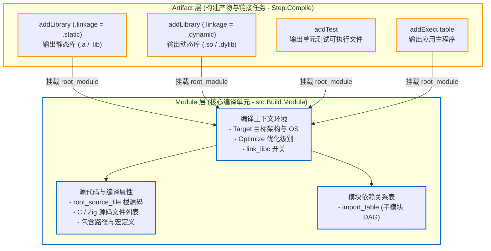

# 编译单元与产物解耦：Module vs Step.Compile

Zig 将“源代码与编译配置单元（Module）”与“最终输出的二进制产物（Step.Compile / Artifact）”分开处理。

---

## 1. 演进背景：产物与配置解耦

在早期 Zig 版本中，宏定义、包含路径、优化选项等配置直接设置在具体的产物对象（如静态库或可执行文件）上：

```zig
// 早期版本的写法（已废弃）：配置与具体产物绑定
const lib = b.addStaticLibrary("mylib", "src/root.zig");
lib.addIncludePath(...);
lib.defineCMacro(...);

// 若同时需要单元测试，需要重复设置相同的配置
const tests = b.addTest("src/root.zig");
tests.addIncludePath(...);
tests.defineCMacro(...);
```

当同一个项目需要同时输出静态库、动态库和测试二进制时，会导致编译参数在多处重复定义。现代 Zig 将编译配置收敛到 Module 中，产物对象只负责指定输出格式与链接行为。

---

## 2. Module 与 Step.Compile 的分工

现代 Zig 的分层结构如下：



### 职责分工：

1. **`std.Build.Module`（编译单元）**：
   - 源码位于 [lib/std/Build/Module.zig](https://codeberg.org/ziglang/zig/src/tag/0.16.0/lib/std/Build/Module.zig)。
   - **职责**：代表一组源文件（Zig 源码、C 源文件或混编）及其所需的编译上下文（`target`、`optimize`、`c_macros`、`include_dirs`、子模块依赖表等）。
   - 它不直接生成 `.a` 或 `.exe` 文件，而是一个可被编译器前端解析的逻辑单元。
2. **`std.Build.Step.Compile`（构建产物 / 链接任务）**：
   - 源码位于 [lib/std/Build/Step/Compile.zig](https://codeberg.org/ziglang/zig/src/tag/0.16.0/lib/std/Build/Step/Compile.zig)。
   - **职责**：驱动编译器与链接器，将指定的 `Module` 编译链接为特定格式的目标二进制（如可执行文件、静态库或动态库）。

---

## 3. 纯 C 静态库中 root_module 的作用

在纯 C 工程中即使没有 `.zig` 源码，创建库时 `root_module` 依然是必填参数（参考 [lib/std/Build.zig](https://codeberg.org/ziglang/zig/src/tag/0.16.0/lib/std/Build.zig) 中的 `addLibrary` 定义）：

```zig
pub const LibraryOptions = struct {
    name: []const u8,
    root_module: *Module,
    linkage: std.builtin.LinkMode = .static,
    version: ?std.SemanticVersion = null,
    // ...
};
```

**原因分析**：
编译 C 源文件同样需要指定目标架构（`target`）、优化级别（`optimize`）、是否链接 C 标准库（`link_libc`）以及包含路径与宏。Zig 将这些通用的编译上下文统一放在 `Module` 中，`addLibrary` 则专注于产物类型与输出控制。

示例代码：

```zig
// 1. 创建包含 C 编译上下文的 Module
const c_module = b.createModule(.{
    .target = target,
    .optimize = optimize,
    .link_libc = true,
});

// 2. 向 Module 添加 C 源码与头文件路径
c_module.addCSourceFiles(.{
    .files = &.{ "src/foo.c", "src/bar.c" },
});
c_module.addIncludePath(b.path("include"));

// 3. 构建静态库
const static_lib = b.addLibrary(.{
    .name = "myclib",
    .linkage = .static,
    .root_module = c_module,
});

// 4. 同时复用该 Module 构建动态库
const shared_lib = b.addLibrary(.{
    .name = "myclib",
    .linkage = .dynamic,
    .root_module = c_module,
});
```

同一份 `c_module` 可以同时提供给静态库、动态库与测试程序使用，避免重复配置。

---

## 4. 正交解耦设计与使用体验

### 4.1 语义与产物的正交分离

`Module` 与 `Artifact` 的分离明确了两者的职责：
- **逻辑与物理分离**：`Module` 负责代码语义与编译上下文（源文件、导入命名空间、宏定义、平台 Target），而 `Artifact` 专注于物理产物形式与链接行为（静态库、动态库还是可执行文件）；
- **减少重复配置**：编写通用库时，通常需要同时构建单元测试与可执行程序。解耦后只需声明一次核心 `Module`，即可直接复用于 `b.addTest` 和 `b.addLibrary`，避免在不同目标间复制编译参数。

### 4.2 局限与认知摩擦

1. **纯 C 项目的额外抽象**：
   在纯 C 库移植过程中，虽然没有 Zig 源码，但创建库产物仍需先通过 `b.createModule` 生成 `root_module`。对于习惯于直接向 Target 添加源文件的 C/CMake 开发者而言，这增加了一层概念映射成本；
2. **模块缺少自动传递导出**：
   Zig 的模块导入表遵循显式隔离原则。若模块 A 依赖基础模块 B，上层模块 C 引入模块 A 后，C 并不能直接访问 B 的符号。如果 C 需要使用 B 的类型，必须由 A 在源码中通过 `pub const B = @import("B");` 重新导出，或者在构建脚本中显式为 C 添加对 B 的 `addImport`。
