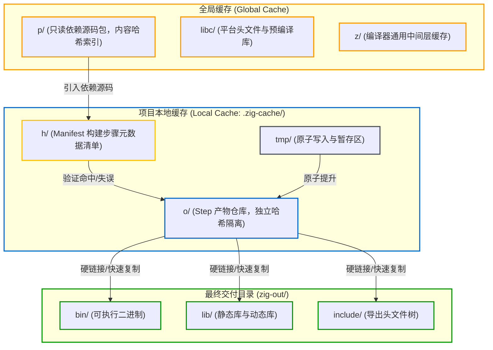
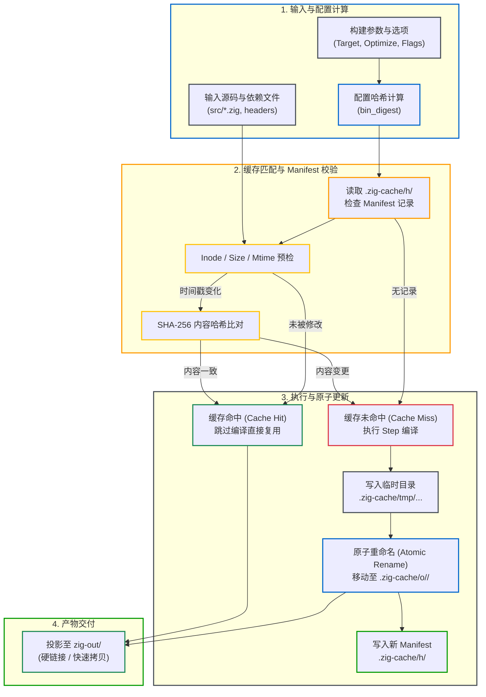

# 包管理与确定性缓存：build.zig.zon 与缓存布局

Zig 的包管理与增量缓存均基于 **内容寻址（Content-Addressed）** 机制设计。依赖包的校验与存放、构建中间步骤的缓存命中以及最终产物的复用，均由输入内容的唯一哈希决定，以保证构建结果的确定性与可重复性。

---

## 1. 包清单声明：`build.zig.zon` 与依赖引入方式

Zig 采用 **ZON (Zig Object Notation)** 语法声明包元数据。ZON 是 Zig 匿名结构体字面量的数据序列化格式，与 Zig 代码语法保持一致。

### 典型 `build.zig.zon` 结构

```zig
.{
    .name = .my_project,
    .version = "0.1.0",
    .fingerprint = 0xd58b8f2d4e195cc9, // 项目全局唯一指纹
    .minimum_zig_version = "0.16.0",

    .dependencies = .{
        // 1. 远程归档依赖（URL + Hash）
        .network = .{
            .url = "https://github.com/MasterQ32/zig-network/archive/refs/tags/v0.1.0.tar.gz",
            .hash = "1220a1b2c3d4e5f67890abcdef...",
        },

        // 2. 本地相对路径依赖（Path）
        .local_utils = .{
            .path = "../shared-utils",
        },

        // 3. Git 仓库直连依赖
        .zlog = .{
            .url = "git+https://github.com/jiacai2050/zlog.git#v0.2.0",
            .hash = "1220456789abcdef0123...",
        },

        // 4. 惰性依赖（按需拉取）
        .heavy_assets = .{
            .url = "https://example.com/assets.tar.gz",
            .hash = "1220987654321fedcba0...",
            .lazy = true,
        },
    },

    .paths = .{
        "build.zig",
        "build.zig.zon",
        "src",
        "LICENSE",
        "README.md",
    },
}
```

### 四种依赖引入方式对比

| 引入方式 | 声明字段 | 是否需要 `.hash` | 典型应用场景 |
| :--- | :--- | :---: | :--- |
| **远程归档** | `.url = "https://..."` | **是** | 生产环境第三方开源库、Release 发布包 |
| **本地路径** | `.path = "../path"` | **否** | Monorepo 多包协同、本地模块解耦开发、离线调试 |
| **Git 直连** | `.url = "git+https://...#ref"` | **是** | 直接锁定 GitHub/GitLab 仓库的分支、Tag 或 Commit |
| **惰性依赖** | 追加 `.lazy = true` | **是** | 仅在特定平台或特定编译选项下才需要的巨型依赖 |

#### 1. 远程归档（URL + Hash）
- 支持 `.tar.gz`、`.tar.xz`、`.tar`、`.zip` 等格式；
- 必须提供 `.hash`。该哈希是包解压后所有源码文件按目录树规则计算得出的 **Multihash**（通常以 `1220` 开头，代表 SHA-256 算法与 32 字节哈希值）。构建系统在下载后会校验此哈希，确保内容未被修改。

#### 2. 本地相对路径（Path）
- 指向相对于当前 `build.zig.zon` 文件的本地目录；
- **无需声明 `.hash`**：本地依赖通常处于修改和调试过程中，Zig 会直接追踪该路径下的文件变更，并在相关源码改动时自动触发增量编译。

#### 3. 惰性依赖（`.lazy = true`）
- 默认情况下，`zig build` 会在执行前解析并下载 `dependencies` 中的所有依赖项；
- 若设置 `.lazy = true`，仅当构建脚本中通过 `b.lazyDependency("heavy_assets", .{})` 显式请求时才会触发下载。常用于跨平台条件依赖（例如特定系统的二进制预编译库），避免在其他平台上下载不必要的大文件；
- 关于运行器如何按需探测并重新触发下载的底层机制，详见 [构建自举：Build Runner 的动态编译与调度 - 5. 惰性依赖的重试机制](../internals/build-runner-internals.md#5-惰性依赖的重试机制)。

#### 4. `.paths` 的作用
`.paths` 声明了当前项目被其他工程作为依赖引入（或计算当前包哈希）时包含的文件与目录列表。未包含在 `.paths` 中的临时文件、日志或测试产物不会影响最终生成的包哈希。

---

## 2. 依赖管理与更新：`zig fetch`

手动下载压缩包、计算哈希并编写 `build.zig.zon` 相对繁琐，Zig 提供了 `zig fetch` 命令行工具来自动化这一流程。

### 常用命令

```bash
# 1. 仅下载包并打印其内容哈希（不修改 build.zig.zon）
zig fetch https://github.com/MasterQ32/zig-network/archive/refs/tags/v0.1.0.tar.gz

# 2. 下载并将依赖追加到 build.zig.zon（字段名由 URL 或包名推导）
zig fetch --save https://github.com/MasterQ32/zig-network/archive/refs/tags/v0.1.0.tar.gz

# 3. 指定依赖在 build.zig.zon 中的字段名称
zig fetch --save=network https://github.com/MasterQ32/zig-network/archive/refs/tags/v0.1.0.tar.gz

# 4. 将本地路径保存到依赖清单中
zig fetch --save=my_lib ../libs/my_lib

# 5. 精确保存原始 URL（不进行规范化压缩）
zig fetch --save-exact=zlog git+https://github.com/jiacai2050/zlog.git#main
```

### 依赖版本更新工作流

当第三方依赖需要升级时，常见有两种操作方式：

1. **命令行自动更新**：
   ```bash
   zig fetch --save=network https://github.com/MasterQ32/zig-network/archive/refs/tags/v0.2.0.tar.gz
   ```
   `zig fetch` 会下载新的归档文件，计算新哈希，并更新 `build.zig.zon` 中对应的 `url` 与 `hash` 字段。

2. **通过编译器报错获取新哈希**：
   在 `build.zig.zon` 中将 `url` 修改为新地址，并将 `hash` 字段设置为空字符串 `""`（或保留旧哈希）。直接运行 `zig build`，编译器会报错并输出实际计算出的哈希：
   ```text
   error: url '...' has hash '1220b2...', but expected hash '1220a1...'
   ```
   将输出中的实际哈希复制回 `build.zig.zon` 即可。

---

## 3. 缓存体系：本地缓存与全局缓存

Zig 采用分层的缓存布局，分为面向单项目的**本地缓存**和跨项目共享的**全局缓存**：



### 1. 全局缓存（Global Cache）
- **默认路径**：
  - Linux: `~/.cache/zig`（遵循 XDG 规范）
  - macOS: `~/Library/Caches/zig`
  - Windows: `%LOCALAPPDATA%\zig`
- **主要内容**：
  - **`p/`（Package 缓存）**：通过网络获取的依赖包均解压在此处，目录名即为其 Multihash（如 `p/1220a1b2c3...`）。多工程若引用相同版本依赖，全局只保留一份解压内容，避免重复下载与占用空间；
  - **`libc/`**：Zig 为目标系统提取的 libc 符号集与头文件；
  - **`z/`**：编译器的中间层共享数据。

### 2. 项目本地缓存（`.zig-cache/`）
位于项目根目录下，通常加入 `.gitignore`：
- **`h/`（Manifest 清单记录）**：
  持久化记录每个 Step 的输入依赖哈希。构建时通过比对 Manifest 判定步骤是否命中缓存；
- **`o/`（Object 编译产物）**：
  每个 Step 独立生成的二进制文件、编译对象（`.o`）及代码生成结果。每个构建配置与源码状态对应一个唯一的 32 位 Hex 子目录（如 `o/a4f3b890.../`），不同 Target、不同 Optimize 模式互不干扰；
- **`tmp/`（临时工作区）**：
  编译和写盘过程中的临时文件暂存区。

---

## 4. 增量构建的缓存判定机制

Zig 构建引擎通过 `std.Build.Cache` 维护两级哈希比对与 Manifest 校验，以此判定 Step 是否命中缓存。



### 判定流程详解

1. **第一级：配置哈希计算（`bin_digest`）**
   当 Step 准备执行时，构建引擎先对其非文件输入进行哈希：
   - 目标架构三元组（Target Triple，如 `aarch64-macos`）；
   - 优化模式（`Debug`、`ReleaseFast`、`ReleaseSafe`、`ReleaseSmall`）；
   - 编译器参数列表（宏定义、头文件搜索路径、链接选项等）；
   - 依赖模块的拓扑指纹。
   任何参数变更都会产生新的配置哈希，指向不同的缓存条目。

2. **第二级：输入文件清单校验（Manifest & Fast Check）**
   配置哈希对应 `.zig-cache/h/<digest>` 中的 Manifest 记录，里面存储了该步骤上一次执行时的所有输入文件元数据：
   - **元数据快速检查（Fast Check）**：引擎首先比对文件的 `inode`、`size` 和 `mtime`（最后修改时间）。若属性一致，直接判定未修改；
   - **内容哈希复验（Content Check）**：当文件修改时间发生变化（例如 `git checkout` 或编辑器保存触碰了 mtime）但实际内容未变时，Zig 会进一步计算文件的 SHA-256 并与 Manifest 比对。若哈希一致，依然判定为缓存命中（Cache Hit），避免了仅因时间戳变动导致的重复编译。

3. **第三级：执行与原子提交（Atomic Update）**
   - **命中（Hit）**：Step 标记为 `result_cached = true`，直接跳过实际编译工作；
   - **未命中（Miss）**：执行该 Step 的编译或运行任务。产物先写入 `.zig-cache/tmp/<uuid>` 临时目录。只有当子进程成功退出且退出码为 0 时，引擎才通过操作系统的**原子重命名（Atomic Rename）**将其移动至 `.zig-cache/o/<digest>/`，并写入新的 Manifest 文件；
   - **异常安全**：若构建过程被手动中断（如 `Ctrl+C`）或编译失败，临时文件仅停留在 `tmp/` 中，不会在产物目录 `o/` 留下残缺文件。

---

## 5. 产物安装：`.zig-cache` 与 `zig-out` 的关系

构建项目时，`.zig-cache/` 与 `zig-out/` 承担着不同的角色：

- **`.zig-cache/` 是内部构建缓存**：
  构建过程中生成的所有中间产物、目标文件与二进制都保存在 `.zig-cache/o/<hash>/` 中。这些目录是由哈希构成的扁平化存储，供构建引擎内部索引使用，不建议外部脚本直接依赖该目录结构；
- **`zig-out/` 是最终交付目录（Installation Prefix）**：
  当在 `build.zig` 中调用安装步骤时：
  ```zig
  b.installArtifact(exe);
  lib.installHeadersDirectory(...);
  ```
  安装步骤会将对应的最终二进制或头文件**以硬链接（Hardlink）或复制的形式**从 `.zig-cache/o/<hash>/` 输出到 `zig-out/bin/` 或 `zig-out/include/` 中。

因此：
- 即使删除 `zig-out/` 目录，只要 `.zig-cache/` 保持完整，重新执行 `zig build` 时仅需重新建立硬链接或轻量复制即可完成产物输出；
- 即使清理了项目内的 `.zig-cache/`，只要全局缓存 `~/.cache/zig/p/` 存在，Zig 仍可以直接使用本地已解压的依赖包，无需重复联网拉取。
