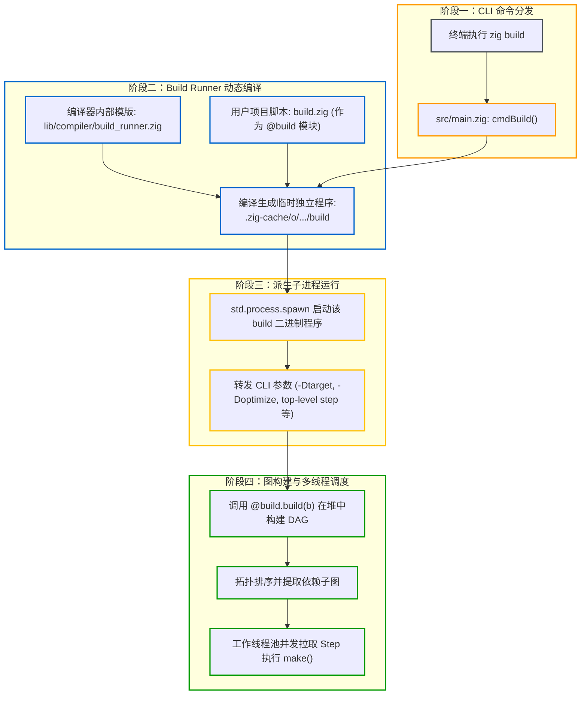
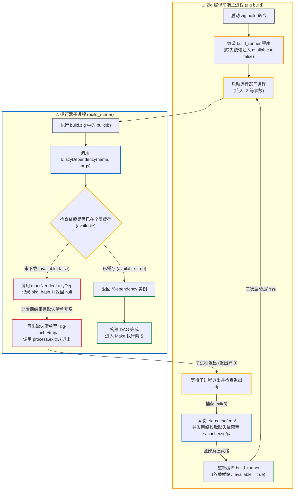

# 构建自举：Build Runner 的动态编译与调度

执行 `zig build` 时，Zig 既没有内置解释器来动态解释 `build.zig`，也没有将构建逻辑固化在编译器二进制中，而是采用自举动态编译（Bootstrap Dynamic Compilation）机制：先将 `build.zig` 编译为独立的构建运行器程序，再启动运行。

---

## 1. 架构总览：从命令路由到独立运行器

从执行 `zig build` 到构建图调度执行，主要分为四个阶段：



---

## 2. 源码级机制：运行器的动态组装

1. **命令路由**：
   在 Zig 编译器入口 [src/main.zig](https://codeberg.org/ziglang/zig/src/tag/0.16.0/src/main.zig) 中，命令行解析器识别到子命令 `build`，路由进入 `cmdBuild` 函数。
2. **装载 `build_runner.zig`**：
   Zig 内置了一个运行器模版文件 `lib/compiler/build_runner.zig`。编译器创建一个编译单元：
   - 将 `build_runner.zig` 作为根源文件；
   - 将用户工作区中的 `build.zig` 映射为一个特殊的模块名称 `@build`。
3. **编译为独立临时程序**：
   Zig 使用 Native Debug 后端快速将其编译为一个独立的可执行文件，落盘存放在：
   `.zig-cache/o/<hash>/build`
4. **子进程执行**：
   `cmdBuild` 随后调用操作系统的 `spawn` 接口，启动该 `build` 二进制程序，并将终端接收到的所有参数原封不动地转发过去。

---

## 3. 调度引擎：拓扑排序与多线程工作池

在编译好的 `build` 程序内部：

1. **执行 `@build.build(b)`**：
   在单线程中初始化 `std.Build` 上下文，调用用户的构建函数，生成内存 DAG。
2. **提取执行子图与拓扑排序**：
   如果用户指定了构建目标（例如 `zig build test`），运行器遍历图结构，裁剪出所有未执行的前置依赖节点。
3. **并发任务队列推进**：
   运行器内置了工作线程池（Worker Pool）。调度器循环扫描入度（In-degree）为 0 的节点：
   - 首先通过 `Cache.Manifest` 比对输入指纹，若完全一致则标记为已完成（Cache Hit）；
   - 若未命中，则派发到空闲的工作线程执行 `step.make()`；
   - 当某个节点执行完成，其依赖者的入度减 1；一旦入度降为 0，立即激活并推入并发执行队列。

这一机制确保了依赖图中的各个节点能够在无竞态的前提下全核并发执行。

---

## 4. 运行器自举机制与代价

### 4.1 机器码执行与环境一致性

Zig 构建运行器采用自举编译，直接生成原生可执行文件：
- **执行效率高**：运行器本身是原生二进制程序，图构建与 Manifest 序列化直接以机器码执行，无额外解释器或虚拟机开销；
- **环境一致**：编译 `build.zig` 的编译器与构建项目的编译器是同一套程序，无需依赖宿主机的外部脚本运行时。

### 4.2 局限与代价

1. **冷启动编译开销**：
   在干净环境或修改 `build.zig` 后，执行 `zig build` 时需要先完成运行器的编译与子进程启动，相比直接解析静态配置（如 Cargo.toml）存在短暂的冷启动耗时；
2. **错误堆栈混杂运行器代码**：
   若 `build.zig` 出现运行时 panic，报错堆栈中会包含 `lib/compiler/build_runner.zig` 的内部调度代码，初次排查时需要注意区分用户脚本逻辑与运行器调度代码。

---

## 5. 惰性依赖的重试机制

在 `build.zig.zon` 中标记为 `.lazy = true` 的依赖，在构建初始阶段不会预先拉取。运行器子进程与 `zig` 主进程通过退出码 3 的通信约定，实现了惰性依赖的按需探测与重新触发。

### 5.1 架构设计：为什么运行器自身不直接执行网络下载？

`build_runner` 是由 Zig 编译器动态编译生成的原生子进程，具有常规的用户态权限。构建系统没有让它直接联网下载依赖，主要出于两点考虑：

1. **包管理职责集中在主进程**：
   网络下载、镜像回退、代理配置、Multihash 校验，以及全局缓存（`~/.cache/zig/p/<hash>`）的文件锁与原子解压，都由 `zig` 主进程统一负责。如果让每个项目的临时 `build` 程序都链接 HTTP/TLS 和 Git 客户端，会明显增加运行器的编译开销与二进制体积。
2. **支持批量并发拉取**：
   如果每次在 `lazyDependency` 处同步下载，多个条件依赖就会串行阻塞（下载 A -> 继续执行 -> 发现缺少 B -> 下载 B）。把配置期作为无网络阻塞的探测阶段，可以让运行器一次性收集齐本次构建所需的全部缺失依赖，交由主进程并发拉取。

### 5.2 源码级交互机制与时序

父子进程的协作流程如下：



#### 流程分步说明：

1. **传递临时通信标识（`-Z<nonce>`）**：
   在 `src/main.zig` 中，主进程启动 `build_runner` 时会传入一个 16 字节随机标识 `-Z<nonce>`（即源码中的 `output_tmp_nonce`），作为本次通信的临时文件名。
2. **检查可用性并记录缺失哈希**：
   在 `lib/std/Build.zig` 的 `lazyDependency` 源码中：
   ```zig
   const pkg = @field(deps.packages, decl.name);
   const available = !@hasDecl(pkg, "available") or pkg.available;
   if (!available) {
       markNeededLazyDep(b, pkg_hash);
       return null;
   }
   ```
   如果依赖未下载（全局缓存中不存在），代码生成阶段会把该包的 `available` 设为 `false`。`lazyDependency` 将其哈希加入 `graph.needed_lazy_dependencies`，并返回 `null`。
3. **写出缺失清单并以状态码 3 退出**：
   用户 `build(b)` 函数返回后，`lib/compiler/build_runner.zig` 会检查收集到的依赖：
   ```zig
   if (graph.needed_lazy_dependencies.entries.len != 0) {
       // 将缺失的 pkg_hash 写入 .zig-cache/tmp/<nonce> 文件
       ...
       process.exit(3);
   }
   ```
   只要探测到缺失的惰性依赖，运行器就会把哈希列表写入 `.zig-cache/tmp/<nonce>`，随后调用 `process.exit(3)` 退出，不会进入后续的 Make 编译阶段。
4. **主进程并发拉取并重新运行**：
   主进程捕获到子进程退出码为 3，读取临时文件中的哈希列表，通过网络并发下载这些依赖包，校验 Multihash 并解压至全局缓存目录；随后重新生成元数据、重新编译 `build_runner` 并再次执行。第二轮运行时，依赖的 `available` 已变为 `true`，`b.lazyDependency` 就能正常返回 `*Dependency` 实例。

---

### 5.3 库作者注意事项：提前注册对外模块

运行器的两阶段重试机制对公共库的设计提出了一个明确要求：

> ⚠️ 对外暴露的模块（`b.addModule`）必须在任何因 `lazyDependency == null` 提前返回的代码之前完成注册。

当公共库被下游项目引用时：
- 下游项目的 `build.zig` 通常会先调用 `const dep = b.dependency("your_lib", .{});`，随后通过 `dep.module("your_module")` 获取导出的模块；
- 在第一轮探测阶段，若上游库因为 `b.lazyDependency(...)` 返回 `null` 而直接 `return`，且此时还没有调用 `b.addModule("your_module", ...)`，下游项目在调用 `dep.module` 时就会直接 panic（`unable to find module 'your_module'`）；
- 这个 panic 会导致构建进程非正常退出（退出码不是 3），主进程也就无法进入依赖下载与重新运行流程。

编写包含惰性依赖的公共库时，应优先调用 `b.addModule` 注册对外暴露的模块骨架，然后再处理内部依赖的探测与装配：

```zig
// 推荐写法：先注册对外模块，再处理惰性依赖
pub fn build(b: *std.Build) void {
    const module = b.addModule("my_lib", .{
        .root_source_file = b.path("src/root.zig"),
    });

    const upstream = b.lazyDependency("upstream", .{}) orelse return;
    module.linkLibrary(upstream.artifact("c_lib"));
}
```
这样即使上游依赖尚未就绪、构建脚本在首轮提前退出，下游也能拿到有效的模块引用，让主进程顺利完成两阶段的依赖补全。
