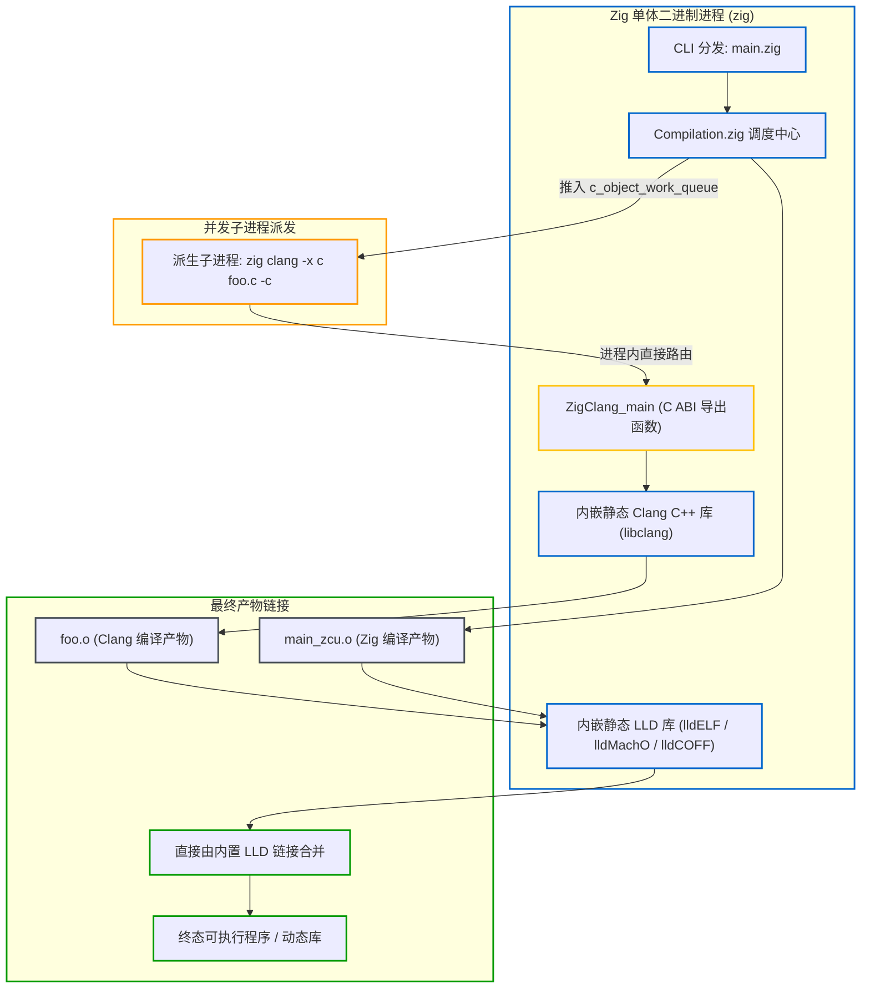

# 内置 C 工具链：嵌入式 Clang 与 LLD 桥接

Zig 编译器内置了 Clang 和 LLD，因此无需在宿主机额外安装外部交叉编译工具链即可支持 C/C++ 源码的编译与链接。这一机制依赖于 Zig 对 Clang 前端与 LLD 链接器的静态内嵌与 FFI 调用。

---

## 1. 架构总览：单体二进制中的 C 工具链



---

## 2. 源码级解析：C++ FFI 桥接机制

Zig 官方在编译 `zig` 编译器自身时，直接将 LLVM、Clang 和 LLD 编译为静态库链接进单体程序中。两者通过标准的 C ABI 进行桥接：

### 2.1 Zig 侧声明：[src/main.zig](https://codeberg.org/ziglang/zig/src/tag/0.16.0/src/main.zig#L5981)
```zig
// In src/main.zig
extern "c" fn ZigClang_main(argc: c_int, argv: [*:null]?[*:0]u8) c_int;
```

### 2.2 C++ 侧导出：[src/zig_clang_driver.cpp](https://codeberg.org/ziglang/zig/src/tag/0.16.0/src/zig_clang_driver.cpp#L467)
```cpp
// In src/zig_clang_driver.cpp
extern "C" int ZigClang_main(int argc, char **argv) {
    return clang_main(argc, argv, {argv[0], nullptr, false});
}
```

当 `zig clang` 命令被触发时，Zig 并不会调用外部系统的 `clang` 可执行文件，而是通过 `ZigClang_main` 直接调用内嵌在当前进程中的 Clang 前端引擎。

---

## 3. 并发 C 编译工作队列：`c_object_work_queue`

当构建图中包含大量 C 源文件时，[src/Compilation.zig](https://codeberg.org/ziglang/zig/src/tag/0.16.0/src/Compilation.zig) 会启动专用的并发编译工作队列：

```zig
// src/Compilation.zig
for (comp.c_object_table.keys()) |c_object| {
    comp.c_object_work_queue.pushBackAssumeCapacity(c_object);
}
```

- 编译线程池并行从 `c_object_work_queue` 中弹出待编译的 C 文件；
- 拼装参数调用 `self_exe_path`（即 `zig` 自身）派生 `zig clang` 子进程；
- 生成的目标文件（`lib.c.o`）直接写入 `.zig-cache/o/` 的哈希隔离目录下。

---

## 4. Zig 与 C 目标文件的链接兼容性

Zig 生成的目标文件与 Clang 编译出的 C 目标文件之所以能直接合并，原因包括：

1. **完全一致的 ABI 遵循**：
   Zig 的函数调用约定原生对齐各大操作系统的标准 C ABI（如 Linux x86_64 的 System V AMD64 ABI，Windows 的 MSVC x64 ABI，以及 ARM 的 AAPCS64）；
2. **完全同构的目标文件格式**：
   Zig 生成的 `main_zcu.o` 与 Clang 编译出的 `c_lib.o` 在结构上没有区别——它们都符合标准 ELF、Mach-O 或 COFF 规范，拥有标准的 `.text` 指令段、`.data` 数据段以及重定位符号表；
3. **内嵌 LLD 链接器统一处理**：
   Zig 内嵌的 LLD 链接器统一完成符号解析与地址重定位，直接输出可执行文件或库文件。

---

## 5. 内置 C 工具链的特点与边界

### 5.1 内置工具链的交叉编译优势

Zig 静态内嵌了 Clang 与 LLD，减少了交叉编译对外部环境的依赖：
- **开箱即用的交叉编译**：下载单一 `zig` 二进制后，即可为 Linux musl、Windows MinGW 或 macOS 等目标编译 C/C++ 代码，无需在宿主机额外配置 `toolchain.cmake` 或安装特定架构的 GCC 工具链；
- **兼容现有项目**：内置的 C/C++ 编译器也可以作为 `zig cc` / `zig c++` 单独调用，直接用于编译现有的纯 C/C++ 项目。

### 5.2 局限与不足

1. **单体发行版体积较大**：
   由于打包了 LLVM 库、Clang 前端、LLD 链接器以及多平台的 libc 符号集合（`lib/libc`），`zig` 单体二进制解压后体积较大（通常在 200MB 以上），在极简容器镜像或存储受限的环境中存在一定成本；
2. **libc 之外的系统库依赖**：
   Zig 内置的主要为**标准 C 库（libc / libm / libpthread / libdl 等）**符号。若待移植的 C 库依赖操作系统特有的外围系统库（如 Linux 下的 `libasound`、`libudev` 或 `X11` 等），内置环境无法直接提供这些符号与头文件，仍需通过 `--sysroot` 指定外部 rootfs 或手动补充对应的依赖库。
