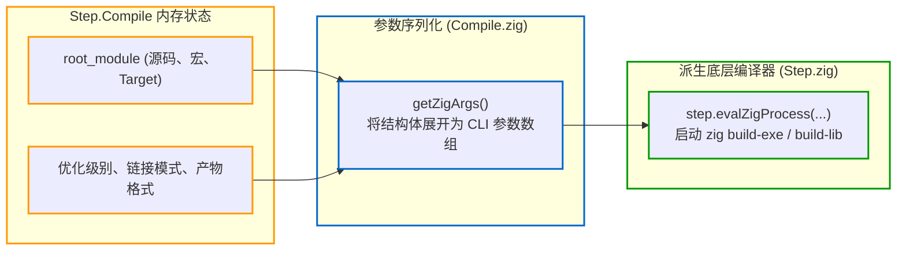

# 编译器交接：Step.Compile 到子进程拼装

`Step.Compile` 负责将构建脚本中的高层配置（源码文件、模块树、编译选项、C 头文件路径等）转换为编译器 CLI 参数，并通过子进程调用底层编译器。

---

## 1. 核心流程：参数序列化与子进程派生

当调度线程池处理未命中的 `Step.Compile` 节点时，会调用其内部的 `make` 方法（`Step.Compile.make`）：



---

## 2. 核心机制：`getZigArgs()`

在 [lib/std/Build/Step/Compile.zig](https://codeberg.org/ziglang/zig/src/tag/0.16.0/lib/std/Build/Step/Compile.zig) 中，`Step.Compile.make()` 首先调用 `getZigArgs()`：

1. **确定子命令类别**：
   根据产物类型（可执行文件、库、测试）确定底层的 Zig CLI 命令：
   - 可执行文件 -> `zig build-exe`
   - 库文件 -> `zig build-lib`
   - 目标文件 -> `zig build-obj`
2. **模块与依赖树平铺**：
   遍历根模块及其引用的所有子模块，使用命令行参数语法进行编码：
   - `-Mroot=src/main.zig`：定义主入口模块；
   - `-Mhelper=src/helper.zig`：定义子模块；
   - `--dep helper`：在根模块与子模块之间声明依赖桥接；
3. **C 源码与头文件包含参数注入**：
   - `-I path/to/include`：注入头文件路径；
   - `-DNAME=VALUE`：注入预处理宏；
   - 将绑定的所有 `.c`、`.cpp` 文件路径追加到命令行尾部。

### 底层 CLI 命令示例

对于一个同时包含 Zig 源码、子模块与 C 语言文件的项目，`getZigArgs()` 组装出的最终命令行大致如下：

```bash
zig build-exe \
  --name my_app \
  -target aarch64-macos-none \
  -O ReleaseFast \
  -Mroot=src/main.zig \
  -Mengine=src/engine.zig \
  --dep engine \
  -I include \
  -DHAVE_CONFIG_H=1 \
  src/native_helper.c \
  --cache-dir .zig-cache \
  --listen=-
```

随后，[lib/std/Build/Step.zig](https://codeberg.org/ziglang/zig/src/tag/0.16.0/lib/std/Build/Step.zig) 中的 `step.evalZigProcess` 通过 IPC 管道启动 `zig` 编译器主进程执行实际编译。

通过下发标准化 CLI 参数调用编译器，构建运行器与编译器实现解耦。当构建出现问题时，开发者也可以直接复制对应命令在终端独立复现与排查。

---

## 3. 编译器解耦机制与代价

### 3.1 进程解耦与命令可复现性

构建运行器与编译器之间采用子进程与 CLI 参数交互：
- **独立的状态空间**：运行器负责推导构建参数，实际编译由独立的子进程执行，避免了在同一个进程中长期驻留可能带来的状态污染；
- **便于独立复现**：执行 `zig build --verbose` 时，终端会打印底层拼装好的完整命令。开发者可以直接复制该命令在命令行中单独执行与排查。

### 3.2 局限与不足

1. **子进程开销与命令行长度**：
   在 Linux 上派生子进程较为轻量，但在 Windows 平台上频繁创建进程会有更多开销。同时，当工程包含大量 C 源码与搜索路径时，命令参数较长，需要依赖参数文件（Response File）机制中转；
2. **默认日志输出折叠较深**：
   未指定 `--verbose` 时，终端默认折叠了子进程的执行命令。当 C 源码出现复杂的预处理警告或头文件搜寻冲突时，精简的界面容易掩盖关键信息，排查时通常需要额外开启详细日志。
