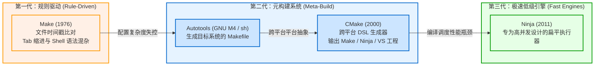

```mermaid
graph TD
    subgraph S_Rust ["Rust 构建生态 (Cargo)"]
        R_Cargo["Cargo 包管理器 & 构建入口"]
        R_Script["build.rs 自定义桥接脚本"]
        R_Ext["外部 C/C++ 库 (cc-rs / cmake-rs)"]
        R_Cargo --> R_Script
        R_Script --> R_Ext
    end

    subgraph S_Go ["Go 构建生态 (go build)"]
        G_Go["go build 单体命令"]
        G_Cgo["CGo (需依赖宿主 GCC/Clang)"]
        G_Ext["外部 C 依赖"]
        G_Go --> G_Cgo
        G_Cgo --> G_Ext
    end

    classDef default fill:#f8f9fa,stroke:#495057;
    style S_Rust fill:#fff0e6,stroke:#ff9900,stroke-width:2px;
    style S_Go fill:#e6f3ff,stroke:#0066cc,stroke-width:2px;
    style R_Cargo fill:#fff0e6,stroke:#ff9900,stroke-width:2px;
    style R_Script fill:#cce5ff,stroke:#0066cc,stroke-width:2px;
    style R_Ext fill:#f8f9fa,stroke:#495057,stroke-width:2px;
    style G_Go fill:#cce5ff,stroke:#0066cc,stroke-width:2px;
    style G_Cgo fill:#fff3cd,stroke:#ffc107,stroke-width:2px;
    style G_Ext fill:#f8f9fa,stroke:#495057,stroke-width:2px;
```

# 构建系统的演进与痛点

在理解 Zig 构建系统为什么这么设计之前，我们需要先回顾软件构建系统数十年来的演变历程，以及传统工具在真实工程落地中遇到的重重困境。

---

## 1. C/C++ 构建工具的百年演进

软件工程诞生之初，源码编译只需要一条简单的单行命令（如 `cc main.c -o main`）。但随着代码体量膨胀至数十万行、跨平台适配需求激增，构建工具经历了多个世代的迭代。

### 1.1 Make 与时间戳判定
- **核心机制**：Make 引入了经典的目标（Target）- 先决条件（Prerequisite）- 命令（Recipe）模型。它通过检测目标文件与输入文件的修改时间（`mtime`）来决定是否重新构建。
- **痛点**：
  1. 语法脆弱：Tab 与空格的严格区分、隐式规则的隐晦推导屡遭诟病；
  2. 跨平台能力极弱：Recipe 中内嵌了强烈的宿主 Shell 偏见（如 `rm -rf`、`cat`、`cp`），在 Windows 下往往寸步难行；
  3. 无法感知编译参数变更：若开发者修改了 `-O2` 为 `-O3`，因源码时间戳未变，Make 不会触发重编。

### 1.2 Autotools 与 CMake（元构建工具）
- **核心机制**：由于 Make 缺乏对操作系统差异的探测抽象，出现了 Autotools（通过数百个 `configure` shell 脚本探测平台特性）以及后来的 CMake。CMake 不直接执行构建，而是通过自己特有的 DSL 解析工程结构，生成对应平台的构建文件（如 Linux 上的 `Makefile` 或 Windows 上的 `vcxproj`）。
- **痛点**：
  1. **专用 DSL 学习成本高昂**：CMake 语法设计并不直观，宏展开作用域模糊，调试困难；
  2. **双重抽象陷阱**：“生成构建文件的工具（CMake）”与“执行构建的引擎（Make/Ninja）”分离，导致报错信息穿透两层，排查错综复杂；
  3. **缺乏官方标准包管理器**：依赖三方库时，仍需开发者手动处理 `find_package`、子模块（git submodule）或配置复杂的 `ExternalProject_Add`。

---

## 2. 现代语言的尝试与局限

进入 2010 年代后，Rust（Cargo）和 Go（Go Modules）将“语言核心”、“包管理器”与“构建工具”深度统一，树立了现代语言构建体验的标准标杆。

然而，当这些现代语言与 **C/C++ 生态**产生交集时，割裂再次出现：

1. **Rust `build.rs` 的二次胶水层**：
   - Cargo 本身只擅长编译 Rust 代码。当依赖像 OpenSSL、SQLite、RocksDB 这样的 C/C++ 库时，必须在 `build.rs` 中通过 `cc` crate 或 `cmake` crate 调用宿主系统的编译器和 CMake。
   - 这意味着用户机器上依然必须装齐 CMake、GCC/Clang、Make，甚至 Python。
2. **Go CGo 的跨编译噩梦**：
   - 纯 Go 代码通过设置 `GOOS=linux GOARCH=arm64` 可以轻松交叉编译；
   - 但只要开启 `CGO_ENABLED=1`，Go 工具链便完全无能为力，必须用户自行在宿主机安装对应的交叉编译工具链（如 `aarch64-linux-gnu-gcc`）。

---

## 3. 交叉编译的永恒噩梦

对于传统的系统级构建工具来说，**交叉编译（Cross-Compilation）** 从来都不是一等公民（First-Class Citizen），而是一场配置灾难：

1. **交叉工具链碎片化**：
   编译 Linux aarch64 需要一套编译器，编译 Windows x86_64 需要另一套 MinGW，编译 macOS 需要苹果独有的 SDK。
2. **目标平台头文件与 libc 缺失**：
   交叉编译 C 程序不仅需要编译器前端，还需要目标操作系统匹配的 C 标准库（glibc / musl / MSVCRT）符号和头文件。安装这些系统依赖在 CI 环境中常常耗费数小时调试。
3. **CMake Toolchain 文件地狱**：
   在 CMake 中进行交叉编译，必须手动编写包含数十项路径重定向（`CMAKE_SYSROOT`、`CMAKE_C_COMPILER` 等）的 `toolchain.cmake`，稍有不慎就会错误引入宿主机的系统库。

---

## 4. 总结：系统级构建需要什么？

总结过去 40 年的教训，一个理想的现代系统级构建系统应当具备以下关键特质：

| 特质 | 传统 Make / CMake | Cargo + build.rs | 理想的构建系统 |
| :--- | :--- | :--- | :--- |
| **脚本语言** | 专用 DSL / Shell | Rust + 外部工具 | **宿主语言本身 (强类型、可重用)** |
| **C/C++ 原生支持** | 原生支持，但配置碎片化 | 二次桥接调用外部工具 | **原生内嵌 C/C++ 编译能力** |
| **跨平台交叉编译** | 极其复杂，依赖外部 sysroot | 依赖宿主交叉工具链 | **开箱即用，零外部工具链依赖** |
| **构建图表达** | 文本规则展开 | 弱依赖图 / 过程式 | **显式声明的有向无环图 (DAG)** |
| **缓存精确度** | 基于文件 mtime (易误判) | 基于 Hash (仅 Rust 文件) | **内容指纹与环境哈希全局确定性比对** |

Zig 正是在深刻洞察了上述历史痛点后，给出了全新的回答。下一章我们将深入剖析 Zig 构建系统的核心设计哲学。
