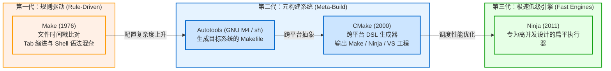

# 构建系统的演进与痛点

在了解 Zig 构建系统的设计之前，先看一下传统 C/C++ 构建工具的演进，以及它们在工程实践中常遇到的问题。

---

## 1. C/C++ 构建工具的演进

早期源码较少时，直接调用单行编译命令（如 `cc main.c -o main`）即可完成构建。随着代码规模增长和平台增加，构建工具逐渐演变出不同形态。

### 1.1 Make 与时间戳判定
- **机制**：Make 采用目标（Target）、先决条件（Prerequisite）和命令（Recipe）模型，通过对比输入文件和目标文件的修改时间（`mtime`）决定是否需要重新编译。
- **局限**：
  1. 语法严格区分 Tab 与空格，隐式推导规则不易排查；
  2. Recipe 直接嵌入宿主 Shell 指令（如 `rm -rf`、`cp`），跨平台（尤其是 Windows）支持需要额外适配；
  3. 仅比对文件时间戳，若仅修改编译选项（如将 `-O2` 改为 `-O3`），Make 不会触发重编。

### 1.2 Autotools 与 CMake（元构建工具）
- **机制**：Autotools 通过 shell 脚本探测环境生成 Makefile；CMake 则使用专用 DSL 描述项目结构，再生成对应平台的工程或构建文件（如 Makefile、Ninja 文件或 Visual Studio 解决方案）。
- **局限**：
  1. 专用 DSL 具有学习成本，宏与变量作用域调试较繁琐；
  2. 生成器（CMake）与执行器（Make/Ninja）分层，排查错误时需要穿透两层工具；
  3. 依赖第三方 C/C++ 库时，仍需开发者手动配置 `find_package`、Git submodule 或外部集成脚本。

---

## 2. 现代语言的尝试与局限

Rust（Cargo）和 Go（Go Modules）将包管理器与构建工具集成在语言发行版中，改善了纯原生语言代码的构建体验。

```mermaid
graph TD
    subgraph S_Rust ["Rust 构建生态 (Cargo)"]
        R_Cargo["Cargo 包管理器 & 构建入口"]
        R_Script["build.rs 自定义桥接脚本"]
        R_Ext["外部 C/C++ 库 (cc-rs / cmake-rs)"]
        R_Cargo --> R_Script
        R_Script --> R_Ext
    end

    subgraph S_Go ["Go 构建生态 (go build)"]
        G_Go["go build 单体命令"]
        G_Cgo["CGo (需依赖宿主 GCC/Clang)"]
        G_Ext["外部 C 依赖"]
        G_Go --> G_Cgo
        G_Cgo --> G_Ext
    end

    classDef default fill:#f8f9fa,stroke:#495057;
    style S_Rust fill:#fff0e6,stroke:#ff9900,stroke-width:2px;
    style S_Go fill:#e6f3ff,stroke:#0066cc,stroke-width:2px;
    style R_Cargo fill:#fff0e6,stroke:#ff9900,stroke-width:2px;
    style R_Script fill:#cce5ff,stroke:#0066cc,stroke-width:2px;
    style R_Ext fill:#f8f9fa,stroke:#495057,stroke-width:2px;
    style G_Go fill:#cce5ff,stroke:#0066cc,stroke-width:2px;
    style G_Cgo fill:#fff3cd,stroke:#ffc107,stroke-width:2px;
    style G_Ext fill:#f8f9fa,stroke:#495057,stroke-width:2px;
```

然而涉及 C/C++ 依赖时，仍存在工具链边界：

1. **Rust `build.rs` 的桥接成本**：
   Cargo 主要负责 Rust 代码编译。当项目依赖 OpenSSL、SQLite、RocksDB 等 C/C++ 库时，通常在 `build.rs` 中通过 `cc` 或 `cmake` crate 调用宿主机的编译器和 CMake，宿主机依然需要安装完整的外部编译工具。
2. **Go CGo 依赖宿主交叉工具链**：
   纯 Go 代码支持通过 `GOOS` 和 `GOARCH` 交叉编译；但开启 `CGO_ENABLED=1` 后，需要宿主机自行安装目标平台的交叉编译工具链（如 `aarch64-linux-gnu-gcc`）。

---

## 3. 传统交叉编译的难点

传统工具链在交叉编译时通常面临以下问题：

1. **交叉工具链维护繁琐**：
   不同目标架构与操作系统（如 Linux aarch64、Windows x86_64、macOS）需要分别配置不同的编译器套件；
2. **目标平台头文件与 libc 缺失**：
   编译 C 程序需要目标系统对应的 C 标准库（glibc / musl / MSVCRT）符号和头文件，在 CI 环境中配置 sysroot 往往需要额外脚本；
3. **Toolchain 配置文件复杂**：
   在 CMake 等工具中交叉编译时，通常需要编写包含路径重定向的 `toolchain.cmake`，配置不当容易误引入宿主系统的头文件和动态库。

---

## 4. 总结：系统级构建的常见诉求

对比不同构建工具的实现策略：

| 维度 | 传统 Make / CMake | Cargo + build.rs | 目标诉求 |
| :--- | :--- | :--- | :--- |
| **脚本语言** | 专用 DSL / Shell | Rust + 外部工具 | 通用编程语言（类型检查与复用性） |
| **C/C++ 原生支持** | 原生支持，配置分散 | 依赖外部调用 | 原生内嵌 C/C++ 编译能力 |
| **跨平台交叉编译** | 依赖外部 sysroot 与工具链 | 依赖宿主交叉工具链 | 开箱可用，无需额外安装外部工具 |
| **构建图模型** | 规则展开 | 过程式脚本 | 显式声明的有向无环图 (DAG) |
| **缓存策略** | 基于文件 mtime | 基于内容哈希 (仅限 Rust) | 基于内容哈希与环境参数比对 |

下一章将介绍 Zig 构建系统的具体设计哲学与实现思路。
