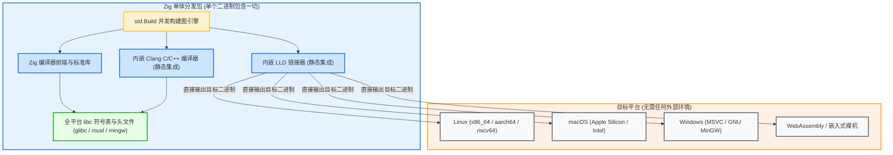

# Zig 构建系统的哲学与愿景

Zig 对构建系统的定位，并不只是为 Zig 语言提供一个编译器调用器，而是旨在**彻底解决现代系统级工程软件的交付难题**。

---

## 1. 拒绝 DSL：用真正的编程语言写构建脚本

软件工程界曾长期流行一种假设：“构建系统应该使用专用的领域特定语言（DSL）”。然而事实证明，随着项目规模扩大，构建逻辑必然会需要循环、条件分支、字符串处理、网络请求、模板替换甚至并发任务管理——专用的 DSL 最终要么退化为一门功能残缺、语法怪异的图灵完备编程语言（如 CMake），要么迫使开发者退回到 Shell 脚本的怀抱。

```mermaid
graph TD
    subgraph S_Trad ["传统模式：多语言割裂"]
        T_DSL["CMakeLists.txt (专用 DSL)"]
        T_Shell["build.sh / setup.bat (宿主 Shell)"]
        T_Src["main.c / lib.cpp (业务代码)"]
        T_DSL -. "生成并调用" .-> T_Shell
        T_Shell -. "编译" .-> T_Src
    end

    subgraph S_Zig ["Zig 模式：单一语言闭环"]
        Z_Build["build.zig (标准 Zig 语言)"]
        Z_API["std.Build (标准库构建图 API)"]
        Z_Src["main.zig / c_code.c (业务代码)"]
        Z_Build -- "使用" --> Z_API
        Z_API -- "驱动编译与代码生成" --> Z_Src
    end

    classDef default fill:#f8f9fa,stroke:#495057;
    style S_Trad fill:#fff0e6,stroke:#ff9900,stroke-width:2px;
    style S_Zig fill:#e6f3ff,stroke:#0066cc,stroke-width:2px;
    style T_DSL fill:#fff0e6,stroke:#ff9900,stroke-width:2px;
    style T_Shell fill:#f8d7da,stroke:#dc3545,stroke-width:2px;
    style T_Src fill:#f8f9fa,stroke:#495057,stroke-width:2px;
    style Z_Build fill:#e6ffe6,stroke:#009900,stroke-width:2px;
    style Z_API fill:#cce5ff,stroke:#0066cc,stroke-width:2px;
    style Z_Src fill:#f8f9fa,stroke:#495057,stroke-width:2px;
```

Zig 的原则极其坚定：**No DSL, Just Zig**。
1. **静态类型与自动补全**：编写 `build.zig` 时，享受与编写普通 Zig 业务代码完全一致的 LSP（Zig Language Server）支持、类型推导、编译期错误检查与重构体验；
2. **复用标准库能力**：无需外部工具，即可直接使用 `std.fs`、`std.mem`、`std.crypto`、`std.fmt` 等丰富而高效的标准库能力；
3. **零学习迁移负担**：学会了 Zig 语法，就已经掌握了编写构建脚本的基础语言工具。

---

## 2. 编译器、链接器与构建系统的“三位一体”

传统语言的构建工具（如 Cargo、CMake、Make）通常是外围独立的包裹层（Wrapper），其自身不具备编译 C 代码或链接二进制的能力，必须不断向操作系统“向外索求”。

而 Zig 的设计理念是**“全栈内嵌、自成宇宙”**：

这带来了革命性的工程优势：
- **真正的自包含（Self-Contained）**：下载一个 50MB~80MB 的 `zig` 压缩包，你就同时拥有了 Zig 编译器、C/C++ 交叉编译器、汇编器、链接器以及全套跨平台 libc 头文件；
- **消除外部系统依赖**：无论宿主机是 Ubuntu、macOS 还是 Windows，只要执行 `zig build -Dtarget=x86_64-windows`，就能直接产出合规的 Windows `.exe` 或 `.lib`，不需要预装 Wine、MinGW 或 Windows SDK。

---

## 3. 声明式计算图模型

虽然 `build.zig` 是一段命令式的 Zig 代码，但它的执行目的却极其纯粹——**在内存中组装一张纯粹的声明式有向无环图（DAG）**。

在 `build(b: *std.Build)` 函数中：
- 你调用的每一个 API（如 `b.addExecutable`、`b.addConfigHeader`），都不是立即执行编译或生成文件；
- 它们只是在堆内存中实例化一个个节点（`std.Build.Step`），并把节点间的数据依赖关系（`LazyPath`）连接成边；
- 组装完成后，真正的执行阶段由 Zig 的多线程并发引擎根据目标 Step 驱动运行。

这种模型将“图的定义”与“图的执行”彻底解耦，为极速并行调度与精确缓存命中奠定了坚实的基础。

---

## 4. 内容寻址与确定性缓存

在传统构建工具中，`make clean` 是开发者最频繁使用的保命命令——因为一旦缓存判定失效，旧的目标文件就会导致链接诡异报错。

Zig 构建系统建立在**内容寻址（Content-Addressed）**和**全输入哈希指纹**之上：
- 文件的变动不依赖不可靠的时间戳，而是输入内容的哈希摘要；
- 编译参数（优化级别、目标架构、预处理宏定义）、编译器版本甚至操作系统环境都会计入 Manifest Hash；
- 只要输入发生哪怕 1 字节的变化，或者命令行改动了一个选项，对应的子图节点立即失效重编；而只要输入未变，命中率达到 100%。

在工程实践中，使用 Zig 构建几乎**不需要执行任何类似 `clean` 的操作**，即可保证构建结果的绝对正确与确定性。
