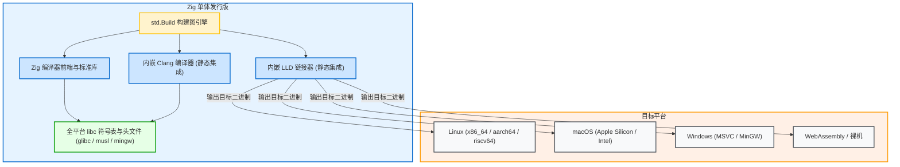

# Zig 构建系统的哲学与愿景

Zig 构建系统的定位不只是调用编译器，还将 C/C++ 交叉编译、任务图编排与包管理整合在统一的接口下。

---

## 1. 拒绝专用 DSL：直接使用 Zig 编写构建脚本

很多构建工具选择引入专用的领域特定语言（DSL）。但随着构建逻辑变得复杂（例如需要循环处理文件、条件判断、动态生成配置或调用外部命令），专用 DSL 往往需要不断扩充语法，或者退回依赖 Shell 脚本。

```mermaid
graph TD
    subgraph S_Trad ["传统模式：多语言与工具混用"]
        T_DSL["CMakeLists.txt (专用 DSL)"]
        T_Shell["build.sh / setup.bat (宿主 Shell)"]
        T_Src["main.c / lib.cpp (业务代码)"]
        T_DSL -. "生成并调用" .-> T_Shell
        T_Shell -. "编译" .-> T_Src
    end

    subgraph S_Zig ["Zig 模式：单一语言表达"]
        Z_Build["build.zig (标准 Zig 语言)"]
        Z_API["std.Build (构建图 API)"]
        Z_Src["main.zig / c_code.c (业务代码)"]
        Z_Build -- "使用" --> Z_API
        Z_API -- "驱动编译与代码生成" --> Z_Src
    end

    classDef default fill:#f8f9fa,stroke:#495057;
    style S_Trad fill:#fff0e6,stroke:#ff9900,stroke-width:2px;
    style S_Zig fill:#e6f3ff,stroke:#0066cc,stroke-width:2px;
    style T_DSL fill:#fff0e6,stroke:#ff9900,stroke-width:2px;
    style T_Shell fill:#f8d7da,stroke:#dc3545,stroke-width:2px;
    style T_Src fill:#f8f9fa,stroke:#495057,stroke-width:2px;
    style Z_Build fill:#e6ffe6,stroke:#009900,stroke-width:2px;
    style Z_API fill:#cce5ff,stroke:#0066cc,stroke-width:2px;
    style Z_Src fill:#f8f9fa,stroke:#495057,stroke-width:2px;
```

Zig 的策略是直接使用普通 Zig 源码编写构建脚本（`build.zig`）：
1. **静态类型与语言服务支持**：编写 `build.zig` 时，可以享受与普通 Zig 源码相同的语法检查、自动补全和重构提示；
2. **复用标准库**：可以直接调用 `std.fs`、`std.mem`、`std.fmt` 等标准库功能处理路径与文本；
3. **无需学习额外语法**：熟悉 Zig 基础语法后，即可阅读和编写构建脚本。

---

## 2. 编译器、链接器与构建系统的集成

传统构建工具通常是外围独立的调用程序，不直接具备编译 C 代码或链接二进制的能力，需要依赖宿主环境已安装的编译器。

Zig 则将编译器、汇编器、链接器以及跨平台 libc 符号表打包在一个二进制分发中：

这种集成带来的特点包括：
- **自包含（Self-Contained）**：单个 `zig` 二进制包含 Zig 编译器、Clang、LLD 以及常见的跨平台 libc 头文件与符号；
- **减少外部环境依赖**：不论宿主机是 Linux、macOS 还是 Windows，只要指定 `-Dtarget=x86_64-windows`，即可直接交叉编译生成 Windows 目标产物，不需要在宿主机额外配置交叉工具链。

---

## 3. 声明式计算图模型

在 `build(b: *std.Build)` 函数中：
- 调用的构建 API（如 `b.addExecutable`、`b.addConfigHeader`）并不立即触发编译或写入中间文件；
- 这些调用在内存中创建任务节点（`std.Build.Step`），并记录输入输出路径（`LazyPath`）；
- 图构建完成后，由调度器根据目标 Step 驱动执行。

这种模型将“图的声明”与“图的执行”分开，为并行调度和增量缓存提供了基础。

---

## 4. 基于内容的增量缓存

传统构建工具常依赖文件修改时间（`mtime`）判断是否重编，若编译参数或环境变化，容易漏编或需要频繁手动 clean。

Zig 构建系统采用基于内容哈希的缓存策略：
- 对源文件内容、编译参数（优化级别、目标架构、预处理宏等）和工具链信息计算哈希签名（Manifest Hash）；
- 输入和参数一致时，复用缓存产物；输入发生变动时，仅重新构建受影响的节点；
- 避免了因时间戳未变或参数变化导致的缓存不一致问题。
