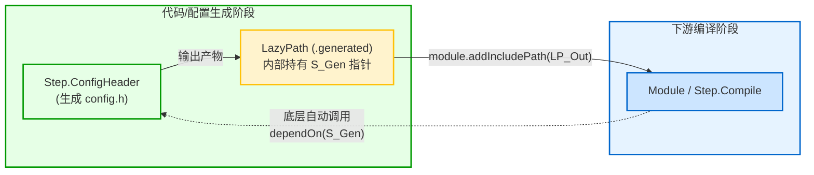

# 数据流与惰性路径：LazyPath 设计原理

在传统的构建脚本（如 Shell、Makefile、甚至早期 CMake）中，文件路径通常用普通的字符串（`const char*` 或 `string`）表示。然而在复杂构建图中，纯字符串路径存在严重的缺陷。

Zig 通过引入 **`std.Build.LazyPath`**（惰性路径），彻底解决了构建过程中的路径上下文与数据流依赖问题。

---

## 1. 为什么纯字符串路径在构建系统中是灾难？

1. **配置期与执行期的时序断层**：
   如果某个头文件是由一个代码生成步骤（如 Protobuf、CMake 模板渲染）动态产生的，在配置阶段该文件**在磁盘上根本不存在**。使用普通字符串无法表达“这个路径将在未来的某一时刻由某个 Step 生成”这一状态。
2. **丢失任务依赖关系**：
   使用字符串路径时，构建系统无法得知下游消费的文件是由哪个上游步骤生产的，开发者不得不频繁手动调用 `consumer.dependOn(generator)`。一旦遗漏，就会引发令人费解的偶发性并发竞态（Race Condition）。
3. **跨包依赖路径迷失**：
   第三方依赖包被下载到全局缓存目录中（如 `~/.cache/zig/p/...`）。下游项目引用上游包的文件时，普通相对路径直接失效。

---

## 2. LazyPath 源码定义与变体

在 [lib/std/Build.zig](https://codeberg.org/ziglang/zig/src/tag/0.16.0/lib/std/Build.zig#L2336) 中，`LazyPath` 被定义为一个联合枚举体（Tagged Union）：

```zig
// lib/std/Build.zig
pub const LazyPath = union(enum) {
    src_path: struct {
        owner: *std.Build,
        sub_path: []const u8,
    },
    generated: struct {
        file: *const GeneratedFile,
        up: usize = 0,
        sub_path: []const u8 = "",
    },
    cwd_relative: []const u8,
    dependency: struct {
        dependency: *Dependency,
        sub_path: []const u8,
    },

    // Add dependent step automatically
    pub fn addStepDependencies(self: LazyPath, other_step: *Step) void {
        switch (self) {
            .src_path => {},
            .cwd_relative => {},
            .dependency => {},
            .generated => |gen| other_step.dependOn(gen.file.step),
        }
    }
    // ...
};
```

### 四大核心变体解析：

1. **`.src_path`（当前项目源码路径）**：
   通过 `b.path("src/main.zig")` 创建。它将相对路径绑定在当前 `*std.Build` 根目录下，保证工程可迁移性。
2. **`.generated`（动态生成物路径）**：
   由生成类 Step 输出（例如 `config_header.getOutput()`、`write_files.getDirectory()`）。其内部持有生成该文件的 `*const GeneratedFile` 及生成它的 `Step` 指针。
3. **`.dependency`（依赖包内部路径）**：
   通过 `dep.path("include/foo.h")` 创建。它将相对路径解析到第三方依赖包解压后的物理目录中。
4. **`.cwd_relative`（外部环境路径）**：
   指向用户操作系统当前工作目录的绝对或相对路径（如系统级头文件目录）。

---

## 3. 自动依赖推导机制（Data-Flow Driven）

`LazyPath` 最精妙的能力，在于**基于数据流自动建立任务依赖边**：



如上方代码段所示，`LazyPath.addStepDependencies` 方法中：
```zig
.generated => |gen| other_step.dependOn(gen.file.step),
```
当你将一个动态生成的 `LazyPath` 传递给下游函数时（例如 `module.addIncludePath(config_h.getOutput())`）：
- Zig 构建系统在底层自动调用 `addStepDependencies`；
- 下游的编译 Step 自动向生成 Step 添加了一条 `dependOn` 边；
- **开发者完全不需要手动维护两者之间的先后顺序！**

数据引用的流向，自然而然地转化为了构建图的执行流，不仅极大简化了构建脚本的编写，还从根本上杜绝了并发构建时的时序竞态 BUG。
