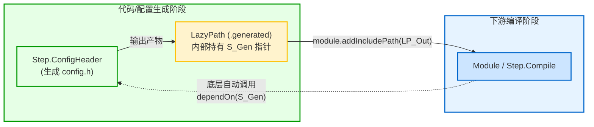

# 数据流与惰性路径：LazyPath 设计原理

在构建脚本中直接使用字符串表示文件路径，在处理跨包依赖和动态生成文件时往往不够灵活。

Zig 引入 `std.Build.LazyPath`（惰性路径）来统一抽象路径来源，并在引用生成文件时自动推导依赖时序。

---

## 1. 纯字符串路径在构建系统中的问题

1. **时序与文件存在性断层**：
   如果某个头文件是由前置步骤（如代码生成、配置头渲染）动态生成的，在配置阶段该文件在磁盘上并不存在。纯字符串无法表达“该文件将在后续某个步骤由谁生成”的信息；
2. **需要手动维护依赖边**：
   使用普通字符串路径时，构建系统无法得知下游引用的文件来自哪个步骤，开发者必须手动调用 `consumer.dependOn(generator)`。一旦遗漏，容易在多线程构建时出现找不到文件的时序问题；
3. **第三方依赖包路径定位**：
   第三方依赖包被解压在全局缓存目录下，下游工程若直接拼接相对路径字符串，不易跨环境维护。

---

## 2. LazyPath 源码定义与变体

在 [lib/std/Build.zig](https://codeberg.org/ziglang/zig/src/tag/0.16.0/lib/std/Build.zig#L2336) 中，`LazyPath` 被定义为一个联合枚举体（Tagged Union）：

```zig
// lib/std/Build.zig
pub const LazyPath = union(enum) {
    src_path: struct {
        owner: *std.Build,
        sub_path: []const u8,
    },
    generated: struct {
        file: *const GeneratedFile,
        up: usize = 0,
        sub_path: []const u8 = "",
    },
    cwd_relative: []const u8,
    dependency: struct {
        dependency: *Dependency,
        sub_path: []const u8,
    },

    // Add dependent step automatically
    pub fn addStepDependencies(self: LazyPath, other_step: *Step) void {
        switch (self) {
            .src_path => {},
            .cwd_relative => {},
            .dependency => {},
            .generated => |gen| other_step.dependOn(gen.file.step),
        }
    }
    // ...
};
```

### 四种核心变体：

1. **`.src_path`（项目源码树路径）**：
   通过 `b.path("src/main.zig")` 创建，将相对路径绑定在当前项目根目录下；
2. **`.generated`（动态生成物路径）**：
   由生成类 Step 输出（如 `config_header.getOutput()`、`write_files.getDirectory()`），内部持有指向生成该文件的 `Step` 指针；
3. **`.dependency`（依赖包内部路径）**：
   通过 `dep.path("include/foo.h")` 创建，将路径解析到第三方依赖包解压后的物理目录中；
4. **`.cwd_relative`（工作区相对路径）**：
   表示相对于终端执行目录或系统绝对路径（如外部系统级目录）。

---

## 3. 基于数据流的自动依赖推导

`LazyPath` 的主要作用之一是根据数据流自动建立任务依赖关系：



在 `LazyPath.addStepDependencies` 中：
```zig
.generated => |gen| other_step.dependOn(gen.file.step),
```
当将一个动态生成的 `LazyPath` 传递给下游函数时（例如 `module.addIncludePath(config_h.getOutput())`）：
- Zig 构建系统在底层自动调用 `addStepDependencies`；
- 下游编译步骤会自动向生成步骤添加一条依赖边；
- 避免了手动调用 `dependOn` 的遗漏，使任务图的执行时序与数据流保持一致。
