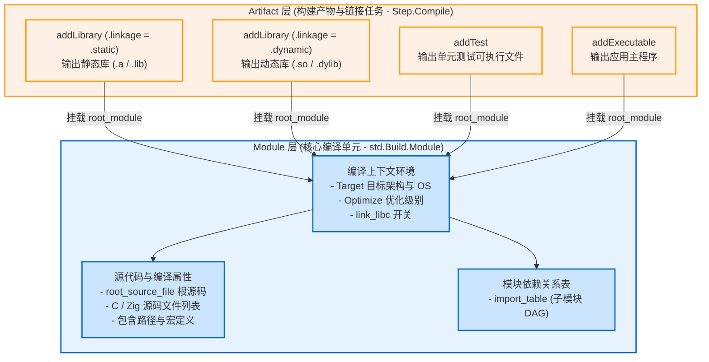

# 编译单元与产物解耦：Module vs Step.Compile

在现代 Zig（0.12+ 直至 0.16.0）中，最优雅也是最重要的设计重构之一，就是**将“源代码编译单元（Module）”与“最终输出的二进制产物（Step.Compile / Artifact）”彻底解耦**。

---

## 1. 历史沿革：传统方式的重复与痛点

在早期 Zig 版本中，编译配置（包含宏定义、包含路径、优化选项、链接 libc 等）是直接设置在具体产物对象上的：
```zig
// 早期版本的做法 (已废弃)：配置与具体产物强耦合
const lib = b.addStaticLibrary("mylib", "src/root.zig");
lib.addIncludePath(...);
lib.defineCMacro(...);

// 若此时想加一个单元测试，必须重复配置一遍！
const tests = b.addTest("src/root.zig");
tests.addIncludePath(...);  // 重复配置
tests.defineCMacro(...);    // 重复配置
```

这种设计在复杂项目中会导致灾难性的配置冗余。如果一个项目需要同时输出：
- 静态库（`.a` / `.lib`）
- 动态库（`.so` / `.dylib` / `.dll`）
- 单元测试运行器（Test Binary）
- 集成示例可执行程序（Example Executable）

开发者将被迫在每个产物对象上复制粘贴完全相同的宏定义、编译参数与 C 源文件列表。

---

## 2. 现代架构：Module 与 Step.Compile 的分工

现代 Zig 引入了清晰的分层抽象：



### 职责边界：

1. **`std.Build.Module`（编译单元）**：
   - 源码位于 [lib/std/Build/Module.zig](https://codeberg.org/ziglang/zig/src/tag/0.16.0/lib/std/Build/Module.zig)。
   - **职责**：代表一组源文件（Zig 源码、C 源文件或混编）及其所需的编译上下文（`target`、`optimize`、`c_macros`、`include_dirs`、依赖的其他子模块等）。
   - 它**不负责**生成具体的二进制文件格式，纯粹是一个抽象的、可编译的逻辑单元。
2. **`std.Build.Step.Compile`（构建产物 / 链接任务）**：
   - 源码位于 [lib/std/Build/Step/Compile.zig](https://codeberg.org/ziglang/zig/src/tag/0.16.0/lib/std/Build/Step/Compile.zig)。
   - **职责**：驱动编译器后端与链接器，将一个或多个 `Module` 链接打包成指定形态的最终产物（可执行文件、静态库、动态库等）。

---

## 3. 为什么纯 C 库也必须指定 `root_module`？

一个常见疑问是：*“我的工程全部是纯 C 语言编写的 `.c` 文件，根本没有 `.zig` 源码，为什么调用 `b.addLibrary` 依然必须传 `root_module`？”*

查看 [lib/std/Build.zig](https://codeberg.org/ziglang/zig/src/tag/0.16.0/lib/std/Build.zig) 中 `addLibrary` 的签名：

```zig
pub const LibraryOptions = struct {
    name: []const u8,
    root_module: *Module,
    linkage: std.builtin.LinkMode = .static,
    version: ?std.SemanticVersion = null,
    // ...
};
```

**原因分析**：
即便是纯 C 代码，编译时也必须明确：
- 目标平台 CPU 架构与操作系统（`target`）；
- 编译优化策略（Debug / ReleaseFast / ReleaseSmall 等）；
- 是否需要链接 C 标准库（`link_libc = true`）；
- 全局包含路径与预处理宏定义。

Zig 将所有这些与“代码如何被编译”相关的上下文统一收拢在 `Module` 中。因此，即使没有 Zig 根文件，我们也只需创建一个拥有编译上下文的 Module：

```zig
// Create module carrying C compilation flags and target
const c_module = b.createModule(.{
    .target = target,
    .optimize = optimize,
    .link_libc = true,
});

// Attach C sources and headers to the module
c_module.addCSourceFiles(.{
    .files = &.{ "src/foo.c", "src/bar.c" },
});
c_module.addIncludePath(b.path("include"));

// Now build static library from this module
const static_lib = b.addLibrary(.{
    .name = "myclib",
    .linkage = .static,
    .root_module = c_module,
});

// Reuse the exact same module to build shared library!
const shared_lib = b.addLibrary(.{
    .name = "myclib",
    .linkage = .dynamic,
    .root_module = c_module,
});
```

同一份 `c_module` 既喂给了静态库，又喂给了动态库，**零冗余配置，完美实现工程资产复用**。
