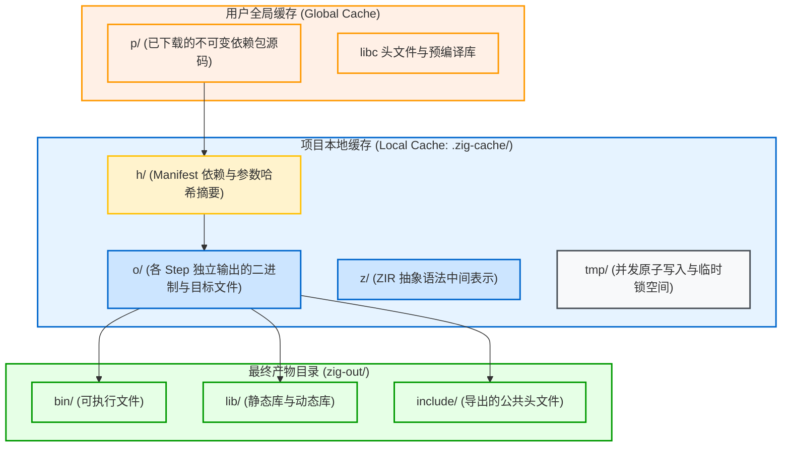

# 包管理与确定性缓存：build.zig.zon 与缓存布局

构建系统的效率与可靠性，极大程度取决于其**依赖包管理机制**与**底层增量缓存设计**。Zig 在这两方面都采用了激进的内容寻址（Content-Addressed）策略。

---

## 1. 包清单清单声明：`build.zig.zon`

从 Zig 0.11 开始，官方引入了包管理器。其元数据文件采用 **ZON (Zig Object Notation)** 语法，即 Zig 匿名结构体的字面量表示法，摒弃了 JSON、TOML 等外部标记语言。

### 典型 `build.zig.zon` 文件结构：

```zig
.{
    .name = .example_project,
    .version = "0.1.0",
    .fingerprint = 0xd58b8f2d4e195cc9, // Unique project fingerprint
    .minimum_zig_version = "0.16.0",

    .dependencies = .{
        .mariadb = .{
            .url = "https://github.com/jiacai2050/zig-mariadb-connector/archive/refs/tags/v0.1.0.tar.gz",
            .hash = "1220a1b2c3d4e5f6...", // Content hash (SHA-256 Multihash)
        },
    },

    .paths = .{
        "build.zig",
        "build.zig.zon",
        "src",
        "LICENSE",
        "README.md",
    },
}
```

### 核心要素说明：
1. **`.hash`（内容寻址防篡改）**：
   第三方依赖的 `.hash` 字段并不是普通的 Git Commit ID，而是由 Zig 计算出的该包全部源码内容的 **Multihash**（格式通常为 `1220` 前缀加上 32 字节 SHA-256）。只要远程仓库的内容发生哪怕 1 字节的变化，哈希比对就会立即失败，从协议层杜绝了中间人攻击和供应链污染。
2. **`.paths`（包分发白名单）**：
   定义了在将当前包打包分享或作为依赖引用时，哪些目录和文件应该被纳入哈希计算。测试数据、临时文档等未列出的文件会被自动排除。
3. **菱形依赖（Diamond Dependency）处理**：
   Zig 包管理器支持同一依赖库的不同语义化版本在不同模块中共存。模块间的依赖在构建图中按需解析，不会发生 C 生态常见的符号冲突。

---

## 2. 缓存体系：本地缓存 vs 全局缓存

Zig 构建系统拥有两级缓存体系：



### 1. 全局缓存（Global Cache）
- **路径**：Linux 上位于 `~/.cache/zig`，macOS 上位于 `~/Library/Caches/zig`，Windows 上位于 `%LOCALAPPDATA%\zig`。
- **职责**：跨项目共享已下载的只读依赖包（`p/` 目录）以及通用的平台符号库。依赖包按哈希名作为目录存储，完全不可变。

### 2. 本地缓存（`.zig-cache/`）
位于项目根目录下，包含以下四大核心子目录：
- **`h/` (Manifest Records)**：
  存放每一个 Step 运行前由 `Cache.Manifest` 生成的文本指纹文件。记录了输入文件哈希、编译器命令行选项及系统环境。
- **`o/` (Output Objects)**：
  每个 Step 的实际产出（包括编译出的可执行程序、中间 `.o` 目标文件、TranslateC 转译出的 `lib.zig`、Build Runner 自身等）。每个产物放置在独立的哈希隔离子目录中。
- **`z/` (ZIR Caches)**：
  存放无需类型推导的紧凑中间表示（ZIR）。在源码微调时，无需重复进行词法与语法分析。
- **`tmp/` (Atomic Workspace)**：
  在多线程并发构建时，所有生成物首先在 `tmp/` 下写入，写入校验完毕后通过文件系统的**原子重命名（Atomic Rename）**移入 `o/`，避免并发竞态导致读取损坏的半成品文件。

---

## 3. 产物安装：`.zig-cache` 与 `zig-out` 的关系

在 Zig 构建中，必须分清 `.zig-cache/` 与 `zig-out/` 的分工：

- **`.zig-cache/` 是内部存储（Internal State）**：
  构建过程中产生的所有中间文件、目标文件和各 Step 原始产出都在 `.zig-cache/o/` 中。用户不应直接依赖这个目录下的路径。
- **`zig-out/` 是交付输出（Installation Prefix）**：
  只有当构建脚本显式调用了 `b.installArtifact(exe)` 或 `lib.installHeadersDirectory(...)` 时，对应的产物才会被 `Step.InstallArtifact` 从缓存目录拷贝（或硬链接）到 `zig-out/bin/` 或 `zig-out/include/` 中，供终端用户最终消费使用。
