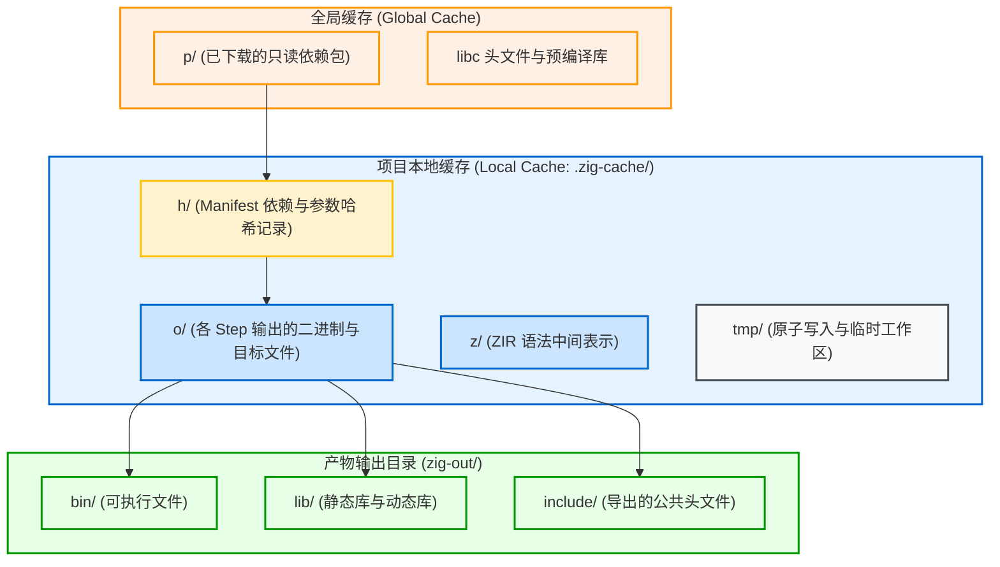

# 包管理与确定性缓存：build.zig.zon 与缓存布局

构建系统的效率与正确性与包管理机制和增量缓存设计密切相关。Zig 在这两方面均采用基于内容哈希（Content-Addressed）的设计。

---

## 1. 包清单声明：`build.zig.zon`

Zig 采用 **ZON (Zig Object Notation)** 语法声明包元数据，即直接使用 Zig 匿名结构体的字面量表示法。

### 典型 `build.zig.zon` 结构：

```zig
.{
    .name = .example_project,
    .version = "0.1.0",
    .fingerprint = 0xd58b8f2d4e195cc9, // Unique project fingerprint
    .minimum_zig_version = "0.16.0",

    .dependencies = .{
        .mariadb = .{
            .url = "https://github.com/jiacai2050/zig-mariadb-connector/archive/refs/tags/v0.1.0.tar.gz",
            .hash = "1220a1b2c3d4e5f6...", // Content hash (SHA-256 Multihash)
        },
    },

    .paths = .{
        "build.zig",
        "build.zig.zon",
        "src",
        "LICENSE",
        "README.md",
    },
}
```

### 字段说明：
1. **`.hash`（内容哈希校验）**：
   第三方依赖的 `.hash` 是根据解压后的源码目录内容计算得出的 Multihash（通常由 `1220` 前缀与 32 字节 SHA-256 组成）。若远端文件内容与声明的哈希不符，下载时会直接报错退出；
2. **`.paths`（纳入哈希计算的文件列表）**：
   指定当前包在计算包指纹或分发时包含的目录和文件，未列出的测试数据或临时文件不参与哈希计算；
3. **依赖版本隔离**：
   Zig 包管理器支持不同模块按需引入不同版本的依赖项，并在构建图中独立解析。

---

## 2. 缓存体系：本地缓存 vs 全局缓存

Zig 构建系统区分全局缓存与本地缓存：



### 1. 全局缓存（Global Cache）
- **默认路径**：Linux 为 `~/.cache/zig`，macOS 为 `~/Library/Caches/zig`，Windows 为 `%LOCALAPPDATA%\zig`；
- **作用**：存放跨项目共享的只读依赖包源码（`p/` 目录）与平台符号。

### 2. 项目本地缓存（`.zig-cache/`）
位于项目根目录下：
- **`h/` (Manifest Records)**：
  保存各个 Step 运行时的哈希摘要，包含源文件摘要、命令行参数及环境信息，用于比对缓存命中状态；
- **`o/` (Output Objects)**：
  存放各个 Step 生成的产物（包括中间 `.o` 目标文件、TranslateC 输出的 `lib.zig`、编译出的二进制等），每个产物放置在独立的哈希子目录中；
- **`z/` (ZIR Caches)**：
  存放无类型中间表示（ZIR），增量重编时无需重新进行词法和语法分析；
- **`tmp/` (Atomic Workspace)**：
  构建过程中新生成的文件先写入 `tmp/`，写入完成后通过文件系统的原子重命名移动到 `o/`，防止多线程写入中断留下破损文件。

---

## 3. 产物安装：`.zig-cache` 与 `zig-out` 的关系

构建过程中需要区分 `.zig-cache/` 与 `zig-out/`：

- **`.zig-cache/` 是内部存储（Internal State）**：
  构建产生的中间文件和原始 Step 产物默认保存在 `.zig-cache/o/` 中，外部工具和调用者不应直接依赖该目录下的临时哈希路径；
- **`zig-out/` 是交付目录（Installation Prefix）**：
  只有当构建脚本显式调用了 `b.installArtifact(exe)` 或 `lib.installHeadersDirectory(...)` 时，对应产物才会被复制或链接到 `zig-out/bin/` 或 `zig-out/include/` 中，作为最终交付结果使用。
