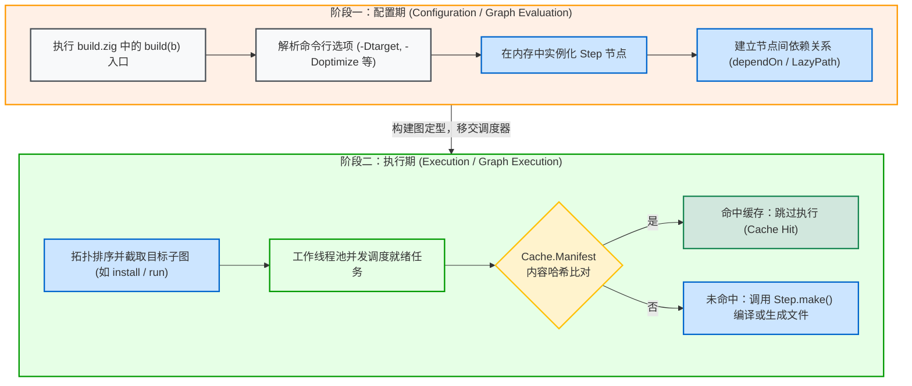

# 两阶段生命周期：配置期与执行期

编写 `build.zig` 时，需要区分配置期（Configuration Phase）与执行期（Execution Phase）。

如果混淆这两个阶段，容易在 `build()` 中尝试直接读取尚未生成的文件而导致文件不存在报错。

---

## 1. 生命周期的两个阶段

执行 `zig build` 时，构建系统依次经历以下两个阶段：



---

## 2. 阶段一：配置期（Graph Evaluation）

配置期由构建运行器调用 `build.zig` 中的公开入口：

```zig
pub fn build(b: *std.Build) void {
    // Configuration logic executed here
}
```

### 核心特征：
1. **内存中构建任务图**：
   在 `build(b)` 函数中调用的 `b.addExecutable`、`b.addLibrary` 或 `b.addConfigHeader` 等 API，不会立即启动编译器，也不会向磁盘输出生成文件。这些 API 负责在堆内存中分配 `std.Build.Step` 节点，记录编译配置并连接依赖边。
2. **执行轻量**：
   由于不涉及编译与重度 I/O，配置阶段通常在几毫秒至几十毫秒内完成。
3. **不能直接读取生成物**：
   不要在 `build()` 中通过同步文件系统 API 读取由前序步骤生成的文件：
   ```zig
   // 错误示例：在配置期读取尚未生成的文件
   const config_h = b.addConfigHeader(...);
   // 此时磁盘上尚未生成 config.h，直接打开会抛出 FileNotFound 异常
   const file = try std.fs.cwd().openFile("config.h", .{});
   ```
   传递生成物路径时，应使用后续章节介绍的 `LazyPath`。

---

## 3. 阶段二：执行期（Graph Execution）

当 `build(b)` 函数返回后，内存中的计算图（DAG）定型，控制权移交给任务调度器。

### 执行流程：
1. **确定目标子图**：
   根据命令行指定的顶层任务（如默认的 `install`，或 `test`/`run`），调度器从目标节点开始反向遍历，截取所需的依赖子图并完成拓扑排序；
2. **多线程并发调度**：
   调度器启动工作线程池，将入度为 0（无前置依赖或前置依赖已就绪）的任务放入待执行队列；
3. **哈希缓存比对**：
   每个 Step 在执行前，会根据输入文件、配置选项和环境信息计算 Manifest Hash。如果 `.zig-cache/` 中已有该哈希的有效记录，则直接跳过（Cache Hit）；
4. **调用 `Step.make()`**：
   未命中缓存时，线程池调用该 Step 的 `makeFn` 函数，执行编译器调用、文件写入或测试运行。

---

## 4. 两阶段对比

| 维度 | 配置期（Configuration Phase） | 执行期（Execution Phase） |
| :--- | :--- | :--- |
| **入口** | `pub fn build(b: *std.Build) void` | `step.makeFn(step, options)` |
| **主要工作** | 声明构建图、解析参数、建立依赖边 | 检查缓存、执行真实编译、产物落盘 |
| **执行方式** | 单线程主流程 | 多线程任务池并发 |
| **文件访问** | 读取只读静态源码与已有配置文件 | 在 `.zig-cache` 与 `zig-out` 中读写中间产物 |
