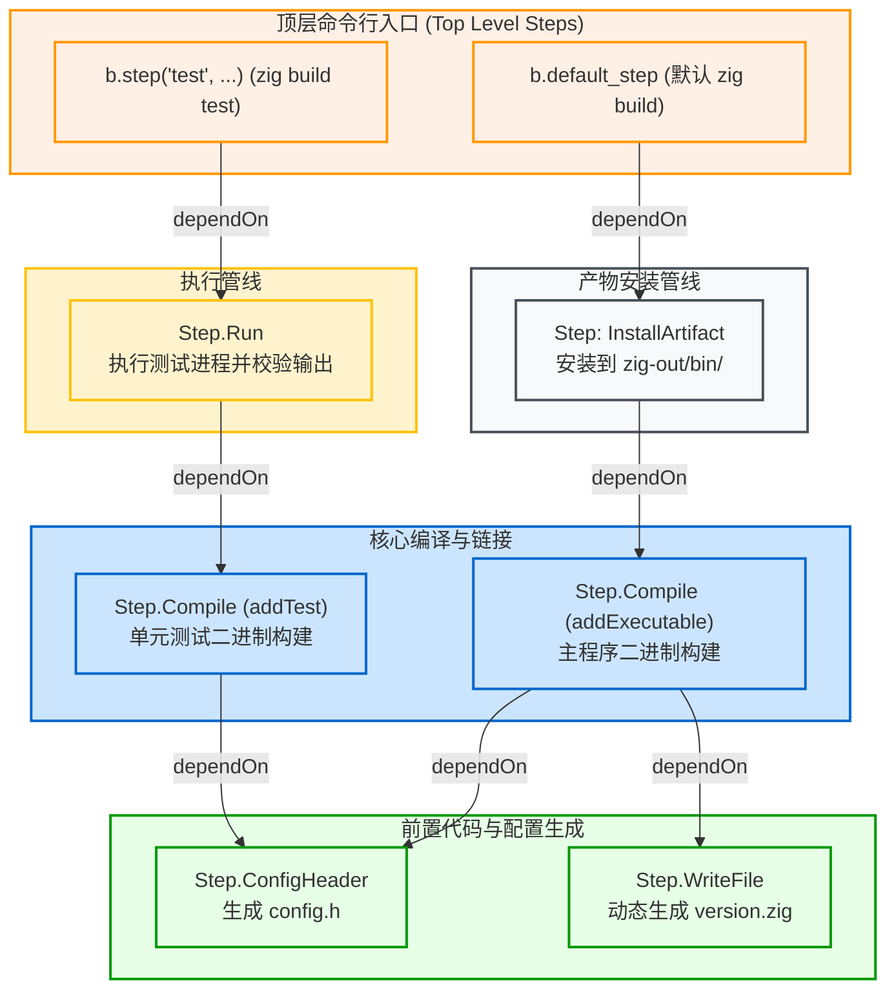

# 计算图抽象：Step 与有向无环图 (DAG)

在 Zig 构建系统中，构建任务被组织为一张有向无环图（DAG），图中的每个任务节点对应一个 `std.Build.Step`。

---

## 1. 什么是 Step？

在 Zig 源码中，[lib/std/Build/Step.zig](https://codeberg.org/ziglang/zig/src/tag/0.16.0/lib/std/Build/Step.zig) 定义了任务节点的通用结构：

```zig
// lib/std/Build/Step.zig
pub const Step = struct {
    pub const Id = enum {
        top_level,
        compile,
        install_artifact,
        install_file,
        install_dir,
        run,
        check_file,
        write_file,
        config_header,
        translate_c,
        options,
        custom,
    };

    pub const MakeFn = *const fn (step: *Step, options: MakeOptions) anyerror!void;

    id: Id,
    name: []const u8,
    owner: *Build,
    makeFn: MakeFn,

    dependencies: std.array_list.Managed(*Step),
    dependants: ArrayList(*Step),
    // ...
};
```

### 核心属性：
1. **任务执行函数（`makeFn`）**：
   函数签名为 `*const fn (step: *Step, options: MakeOptions) anyerror!void`。无论是调用编译器、运行测试、写文件还是转译 C 头文件，只要实现该签名，即可作为构建节点接入任务图。
2. **依赖关系列表（`dependencies` 与 `dependants`）**：
   记录当前节点依赖的前置任务（`dependencies`），以及依赖当前节点的后续任务（`dependants`）。
3. **所属上下文（`owner`）**：
   指向创建该 Step 的 `*std.Build` 实例。

---

## 2. 常见内置 Step 类型

Zig 标准库内置了多种特化的 Step 实现：

| Step 类型 (Id) | 对应结构体 | 职责与常见场景 |
| :--- | :--- | :--- |
| `top_level` | `Step` | 命令行调用的顶层入口（如 `b.step("test", ...)` 或 `b.default_step`） |
| `compile` | `Step.Compile` | 编译与链接任务，生成可执行文件、静态库或动态库 |
| `install_artifact` | `Step.InstallArtifact` | 将产物从缓存目录安装到输出目录（`zig-out/`） |
| `run` | `Step.Run` | 运行生成的可执行文件或外部命令（常用于执行单元测试） |
| `write_file` | `Step.WriteFile` | 在缓存目录动态创建并写入文件 |
| `config_header` | `Step.ConfigHeader` | 解析 `.h.in` 模板并渲染生成配置头文件 |
| `translate_c` | `Step.TranslateC` | 调用编译器将 C 头文件转译为 Zig AST 与 Module |

---

## 3. Step 依赖拓扑图示例

典型的 Zig 项目构建图结构如下：



### 建立依赖：`dependOn`

在代码中通过 `step_a.dependOn(step_b)` 指定先后顺序：

```zig
// 1. 创建顶层命令入口："zig build test"
const test_step = b.step("test", "Run library unit tests");

// 2. 创建单元测试编译步骤
const unit_tests = b.addTest(.{
    .root_module = my_module,
});

// 3. 创建测试执行步骤
const run_unit_tests = b.addRunArtifact(unit_tests);

// 4. 建立依赖边：test_step 依赖 run_unit_tests
test_step.dependOn(&run_unit_tests.step);
```

执行 `zig build test` 时，调度器定位到 `test_step`，沿依赖边发现其需要 `run_unit_tests`，而 `run_unit_tests` 依赖 `unit_tests` 产出二进制，从而按拓扑序依次执行。
