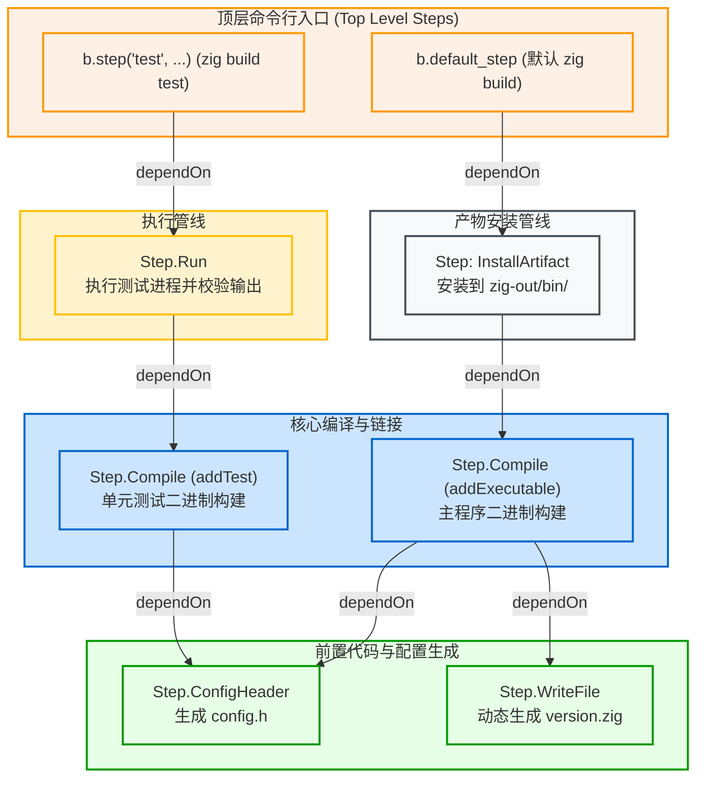

# 计算图抽象：Step 与有向无环图 (DAG)

构建系统的本质，是**任务编排（Task Orchestration）**。在 Zig 构建系统中，整个构建管线被严谨地抽象为一张有向无环图（Directed Acyclic Graph, DAG），图中的每一个任务节点都是一个 `std.Build.Step`。

---

## 1. 什么是 Step？

在 Zig 源码中，[lib/std/Build/Step.zig](https://codeberg.org/ziglang/zig/src/tag/0.16.0/lib/std/Build/Step.zig) 定义了通用的任务节点抽象：

```zig
// lib/std/Build/Step.zig
pub const Step = struct {
    pub const Id = enum {
        top_level,
        compile,
        install_artifact,
        install_file,
        install_dir,
        run,
        check_file,
        write_file,
        config_header,
        translate_c,
        options,
        custom,
    };

    pub const MakeFn = *const fn (step: *Step, options: MakeOptions) anyerror!void;

    id: Id,
    name: []const u8,
    owner: *Build,
    makeFn: MakeFn,

    dependencies: std.array_list.Managed(*Step),
    dependants: ArrayList(*Step),
    // ...
};
```

### 核心属性拆解：
1. **统一的任务契约（`makeFn`）**：
   每个 Step 都挂载了一个执行函数指针：
   `*const fn (step: *Step, options: MakeOptions) anyerror!void`
   无论是调用编译器编译源码、运行测试二进制、写入文件还是转译 C 头文件，只要实现了该接口，就能无缝接入构建图。
2. **依赖关系列表（`dependencies` 与 `dependants`）**：
   记录该节点运行所必须等待的前置依赖（`dependencies`），以及依赖该节点的下游任务（`dependants`）。
3. **所属构建器上下文（`owner`）**：
   指向创建该 Step 的 `*std.Build` 实例。

---

## 2. 常见内置 Step 类型与职责

Zig 标准库根据不同构建需求，内置了一系列特化的 Step 实现：

| Step 类型 (Id) | 对应结构体 | 典型职责与场景 |
| :--- | :--- | :--- |
| `top_level` | `Step` | 命令行直接调用的顶层命名入口（如 `b.step("test", ...)` 或 `b.default_step`） |
| `compile` | `Step.Compile` | 核心编译与链接任务，驱动编译器生成可执行文件、静态库或动态库 |
| `install_artifact` | `Step.InstallArtifact` | 将编译出的二进制产物从缓存目录拷贝安装到全局输出目录（`zig-out/`） |
| `run` | `Step.Run` | 运行生成的可执行文件或外部任意命令（常用于运行单元测试） |
| `write_file` | `Step.WriteFile` | 动态在缓存目录创建并写入文件或代码片段 |
| `config_header` | `Step.ConfigHeader` | 读取 `.h.in` CMake 风格模板，根据配置项渲染并生成 `config.h` |
| `translate_c` | `Step.TranslateC` | 调用编译器将 C 头文件转译为 Zig AST 与 Module |

---

## 3. Step 依赖拓扑图实战

一个典型的 Zig 工程构建图如下图所示：



### 拓扑依赖的建立：`dependOn`
在代码中，我们通过 `step_a.dependOn(step_b)` 建立先后时序：
```zig
// Create top-level step: "zig build test"
const test_step = b.step("test", "Run library unit tests");

// Create unit test executable step
const unit_tests = b.addTest(.{
    .root_module = my_module,
});

// Create run step for executing the test binary
const run_unit_tests = b.addRunArtifact(unit_tests);

// Establish DAG edge: test_step requires run_unit_tests
test_step.dependOn(&run_unit_tests.step);
```

当执行 `zig build test` 时，调度器首先寻找 `test_step`，发现其依赖 `run_unit_tests`，而 `run_unit_tests` 又隐式依赖 `unit_tests`（编译测试二进制）。于是调度器便会自底向上、按照拓扑顺序依次调度执行。
