# C/C++ 互操作与库导出：addTranslateC 与 linkLibrary

Zig 在语言层面支持 C ABI，并在构建系统中提供了头文件转译和包含路径传播机制。

---

## 1. 显式头文件转译：`b.addTranslateC`

除了在源码中使用 `@cImport`，在构建脚本中通过 `b.addTranslateC` 将 C 头文件转译定义为独立的 Step，能够获得更好的构建缓存控制。

```mermaid
graph LR
    H_File["C 头文件 (*.h)"]
    TC_Step["b.addTranslateC 步骤<br/>- 包含路径与宏定义<br/>- 目标平台 target"]
    Z_AST["转译生成的 Zig 源码<br/>.zig-cache/o/.../c.zig"]
    Mod["translate_c.createModule()<br/>导出 Zig Module"]
    Exe["exe.root_module.addImport('c', mod)"]
    Code["Zig 业务代码: const c = @import('c')"]

    H_File --> TC_Step
    TC_Step -- "执行转译" --> Z_AST
    Z_AST --> Mod
    Mod --> Exe
    Exe --> Code

    classDef default fill:#f8f9fa,stroke:#495057;
    style H_File fill:#fff0e6,stroke:#ff9900,stroke-width:2px;
    style TC_Step fill:#cce5ff,stroke:#0066cc,stroke-width:2px;
    style Z_AST fill:#fff3cd,stroke:#ffc107,stroke-width:2px;
    style Mod fill:#e6ffe6,stroke:#009900,stroke-width:2px;
    style Exe fill:#f8f9fa,stroke:#495057,stroke-width:2px;
    style Code fill:#f8f9fa,stroke:#495057,stroke-width:2px;
```



### 使用范式：

```zig
// 1. 声明 TranslateC 步骤
const translate_c = b.addTranslateC(.{
    .root_source_file = b.path("include/my_c_lib.h"),
    .target = target,
    .optimize = optimize,
});

// 为转译步骤添加头文件搜索路径
translate_c.addIncludePath(b.path("include"));

// 2. 将转译结果包装为 Module
const c_module = translate_c.createModule();

// 3. 挂载到主程序
exe.root_module.addImport("c", c_module);
```

### 使用 `addTranslateC` 的优势：
1. **独立缓存**：转译结果写入 `.zig-cache/o/`，头文件未修改时不会重复转译；
2. **多模块共享**：同一个转译出的 `c_module` 可供给多个子模块同时导入；
3. **统一编译器配置**：与工程共享相同的目标架构、编译宏与包含路径。

---

## 2. 头文件自动传播机制：`linkLibrary`

当将 C 源码打包为静态库供下游使用时，下游通常需要同时引入头文件搜索路径。

Zig 的 `linkLibrary` 具备自动传播头文件包含路径的能力。查看 [lib/std/Build/Module.zig:L658](https://codeberg.org/ziglang/zig/src/tag/0.16.0/lib/std/Build/Module.zig#L658)：

```zig
// lib/std/Build/Module.zig
fn linkLibraryOrObject(m: *Module, other: *Step.Compile) void {
    const allocator = m.owner.allocator;
    _ = other.getEmittedBin();

    m.link_objects.append(allocator, .{ .other_step = other }) catch @panic("OOM");
    // 将该库导出的头文件目录树自动追加到当前模块的包含路径中
    m.include_dirs.append(allocator, .{ .other_step = other }) catch @panic("OOM");
}
```

当调用 `linkLibrary` 时，该库包含的公共头文件路径会自动注入到当前模块中，下游不需要再针对该库重复调用 `addIncludePath`。

---

## 3. 上游导出与下游消费范式

### 3.1 上游库导出头文件与 Artifact
库提供方在构建静态库时，将静态头文件目录及动态生成的配置头安装到该产物中：

```zig
// 上游 build.zig
const lib = b.addLibrary(.{
    .name = "foo",
    .linkage = .static,
    .root_module = b.createModule(.{
        .target = target,
        .optimize = optimize,
    }),
});

// 1. 安装静态公共头文件目录
lib.installHeadersDirectory(b.path("include"), "", .{});

// 2. 安装动态生成的配置头文件
lib.installConfigHeader(config_h);

// 3. 导出 Artifact 供下游消费
b.installArtifact(lib);
```

### 3.2 下游消费场景

#### 场景 A：下游是 C/Zig 混编工程（直接链接）
```zig
// 下游 build.zig
const foo_dep = b.dependency("foo", .{ .target = target, .optimize = optimize });
const foo_lib = foo_dep.artifact("foo");

// 链接静态库，并自动引入该库导出的头文件路径
exe.root_module.linkLibrary(foo_lib);
```
下游的 C 源文件可直接 `#include <foo.h>`。

#### 场景 B：下游是纯 Zig 工程（配合 `addTranslateC`）
纯 Zig 项目通过 `addTranslateC` 转译头文件时，由于转译属于前置步骤，需先从上游库产物中提取头文件树路径：

```zig
// 1. 从 Artifact 获取上游导出的头文件树
const lib_artifact = foo_dep.artifact("foo");
translate_c.addIncludePath(lib_artifact.getEmittedIncludeTree());

// 2. 将转译模块导入 Zig 源码
exe.root_module.addImport("foo", translate_c.createModule());

// 3. 链接静态库二进制
exe.root_module.linkLibrary(lib_artifact);
```

> **注意**：`addTranslateC` 仅生成符号声明（`extern fn`）。如果只添加了模块导入而未通过 `linkLibrary` 链接静态库，链接阶段会报符号未定义错误（`undefined reference`）。
