# C/C++ 互操作与库导出：addTranslateC 与 linkLibrary

Zig 对 C/C++ 的互操作支持堪称现代编程语言的典范。不仅源码层面原生支持 C ABI，在构建系统层面更提供了一整套标准化的互操作与头文件流转机制。

---

## 1. 显式头文件转译：`b.addTranslateC`

虽然在 Zig 源码中可以直接编写 `@cImport({ @cInclude("my_header.h"); })`，但在大型工程中，推荐在构建脚本中使用 `b.addTranslateC` 将 C 头文件转译提升为一个**显式的独立 Step**。

```mermaid
graph LR
    H_File["C 头文件 (*.h)"]
    TC_Step["b.addTranslateC 步骤<br/>- 包含路径与宏配置<br/>- 目标平台 target"]
    Z_AST["转译生成的 Zig 源码<br/>.zig-cache/o/.../c.zig"]
    Mod["translate_c.createModule()<br/>包装为 Zig 模块"]
    Exe["exe.root_module.addImport('c', mod)"]
    Code["Zig 业务代码: const c = @import('c')"]

    H_File --> TC_Step
    TC_Step -- "执行转译" --> Z_AST
    Z_AST --> Mod
    Mod --> Exe
    Exe --> Code

    classDef default fill:#f8f9fa,stroke:#495057;
    style H_File fill:#fff0e6,stroke:#ff9900,stroke-width:2px;
    style TC_Step fill:#cce5ff,stroke:#0066cc,stroke-width:2px;
    style Z_AST fill:#fff3cd,stroke:#ffc107,stroke-width:2px;
    style Mod fill:#e6ffe6,stroke:#009900,stroke-width:2px;
    style Exe fill:#f8f9fa,stroke:#495057,stroke-width:2px;
    style Code fill:#f8f9fa,stroke:#495057,stroke-width:2px;
```



### 构建代码声明范式：

```zig
// 1. Declare TranslateC step
const translate_c = b.addTranslateC(.{
    .root_source_file = b.path("include/my_c_lib.h"),
    .target = target,
    .optimize = optimize,
});

// Configure include paths for the C header itself
translate_c.addIncludePath(b.path("include"));

// 2. Wrap into a Zig Module
const c_module = translate_c.createModule();

// 3. Attach to application
exe.root_module.addImport("c", c_module);
```

### 为什么在 `build.zig` 中使用 `addTranslateC` 更好？
1. **构建图缓存独立**：转译产物以物理 `.zig` 源码形式缓存在 `.zig-cache/o/` 中，只要头文件未变，不会触发无意义的重复转译；
2. **多模块复用**：同一个 `c_module` 可以被数十个子模块同时引用；
3. **统一编译器配置**：与应用共享完全相同的 Target 架构、Sysroot 和编译宏。

---

## 2. 头文件自动传播机制：`linkLibrary`

当一个 C 库被封装为静态库 Artifact 时，下游引用它往往不仅需要链接 `.a` 文件，还需要读取其公共头文件。

在 Zig 构建系统中，**`linkLibrary` 具有头文件包含路径自动向上传播的能力**：

查看 [lib/std/Build/Module.zig:L658](https://codeberg.org/ziglang/zig/src/tag/0.16.0/lib/std/Build/Module.zig#L658) 源码：
```zig
// lib/std/Build/Module.zig
fn linkLibraryOrObject(m: *Module, other: *Step.Compile) void {
    const allocator = m.owner.allocator;
    _ = other.getEmittedBin(); // 声明对目标二进制产物的依赖

    m.link_objects.append(allocator, .{ .other_step = other }) catch @panic("OOM");
    // 将该库关联的包含目录树自动追加到当前模块中！
    m.include_dirs.append(allocator, .{ .other_step = other }) catch @panic("OOM");
}
```

这意味着：**只要上游库正确导出了头文件，下游调用 `linkLibrary` 时，头文件搜索路径会自动被注入下游模块，下游完全不需要手动再写一次 `addIncludePath`！**

---

## 3. 上游标准导出与下游消费范式

### 3.1 上游库的标准导出代码
库的提供者应该在编译静态库的同时，将其公共头文件目录与动态配置头安装到该产物中：

```zig
// Upstream build.zig
const lib = b.addLibrary(.{
    .name = "foo",
    .linkage = .static,
    .root_module = b.createModule(.{
        .target = target,
        .optimize = optimize,
    }),
});

// 1. Install static public headers directory
lib.installHeadersDirectory(b.path("include"), "", .{});

// 2. Install dynamically generated configuration header
lib.installConfigHeader(config_h);

// 3. Expose artifact publicly
b.installArtifact(lib);
```

### 3.2 下游消费场景

#### 场景 A：下游是 C/Zig 混编工程（直接链接）
```zig
// Downstream build.zig
const foo_dep = b.dependency("foo", .{ .target = target, .optimize = optimize });
const foo_lib = foo_dep.artifact("foo");

// 一键链接并自动传播所有头文件包含路径
exe.root_module.linkLibrary(foo_lib);
```
下游的 C 源文件即可直接 `#include <foo.h>`。

#### 场景 B：下游是纯 Zig 工程（配合 `addTranslateC`）
纯 Zig 项目需要通过 `addTranslateC` 将头文件翻译为 Zig 接口，此时由于 `addTranslateC` 是前置生成步（尚未链接），需显式提取上游导出的头文件树：

```zig
// 1. Extract include tree from artifact
const lib_artifact = foo_dep.artifact("foo");
translate_c.addIncludePath(lib_artifact.getEmittedIncludeTree());

// 2. Inject translated module into Zig application
exe.root_module.addImport("foo", translate_c.createModule());

// 3. Link static library binary
exe.root_module.linkLibrary(lib_artifact);
```

> **避坑提醒**：
> `addTranslateC` 仅生成符号声明（`extern fn foo_init(...)`）。如果下游只调用了 `addImport` 而**漏掉了 `linkLibrary`**，编译阶段会全部通过，但在最终链接阶段会报出经典的 `undefined reference to 'foo_init'` 错误！
