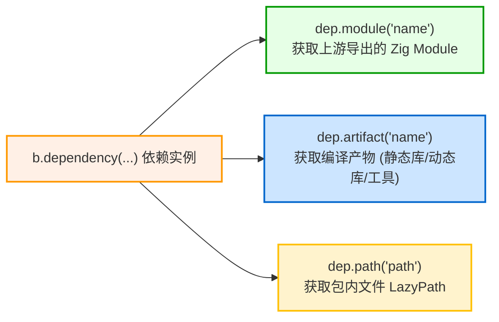

# 第三方依赖引入与消费：b.dependency

当你在 `build.zig.zon` 中声明了第三方依赖后，在 `build.zig` 中即可通过 `b.dependency` API 实例化并消费该包导出的各种资产。

---

## 1. 实例化依赖：`b.dependency`

在 `build(b: *std.Build)` 中：

```zig
// 1. Fetch dependency instance and forward compilation flags
const mariadb_dep = b.dependency("mariadb", .{
    .target = target,
    .optimize = optimize,
    // You can also pass custom options defined in upstream build.zig!
    .enable_tls = true,
});
```

### 关键机制：
- **参数透传**：你可以将当前项目的 `target` 与 `optimize` 透明透传给上游包，确保依赖库与主项目以**完全相同的平台目标和编译优化级别**进行编译；
- **子构建执行**：Zig 会在隔离的命名空间中执行上游包的 `build.zig`，并将其暴露的产物和模块注入到 `*std.Build.Dependency` 对象中。

---

## 2. 消费依赖资产的三大核心方法

一个依赖对象（`dep`）通常提供以下几种资产消费方式：



### 2.1 获取模块：`dep.module`
如果上游包是一个纯 Zig 库，并通过 `b.addModule("foo", ...)` 导出了模块：
```zig
const foo_module = dep.module("foo");
exe.root_module.addImport("foo", foo_module);
```

### 2.2 获取产物：`dep.artifact`
如果上游包编译并导出了一个静态库、动态库或代码生成工具可执行程序：
```zig
// Link C static library exported by dependency
const foo_lib = dep.artifact("foo");
exe.root_module.linkLibrary(foo_lib);
```
如果是工具类可执行文件，甚至可以直接运行它：
```zig
const codegen_tool = dep.artifact("codegen_cli");
const run_tool = b.addRunArtifact(codegen_tool);
```

### 2.3 获取包内物理路径：`dep.path`
若需要直接访问依赖包内部的某些文件（如测试数据集、包含目录、模板等）：
```zig
// Returns a LazyPath pointing to dependency's directory
const headers_path = dep.path("include");
module.addIncludePath(headers_path);
```
