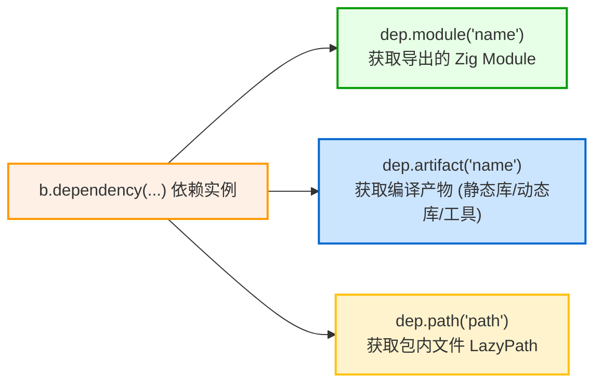

# 第三方依赖引入与消费：b.dependency

在 `build.zig.zon` 中声明第三方依赖后，可在 `build.zig` 中通过 `b.dependency` API 获取并消费依赖导出的模块与产物。

---

## 1. 实例化依赖：`b.dependency`

在 `build(b: *std.Build)` 中：

```zig
// 实例化依赖项并透传编译选项
const mariadb_dep = b.dependency("mariadb", .{
    .target = target,
    .optimize = optimize,
    // 也可透传上游 build.zig 定义的自定义选项
    .enable_tls = true,
});
```

### 关键机制：
- **参数传递**：将当前项目的 `target` 与 `optimize` 传递给上游包，确保依赖库与主项目使用一致的平台目标和优化选项；
- **子构建执行**：Zig 会在独立的命名空间中执行上游包的 `build.zig`，并将其暴露的产物和模块收敛在 `*std.Build.Dependency` 实例中。

---

## 2. 消费依赖项的三种常见方式

依赖对象（`dep`）通常提供以下获取方式：



### 2.1 获取模块：`dep.module`
如果上游包导出了 Zig 模块（通过 `b.addModule("foo", ...)`）：
```zig
const foo_module = dep.module("foo");
exe.root_module.addImport("foo", foo_module);
```

### 2.2 获取产物：`dep.artifact`
如果上游包导出了静态库、动态库或工具程序：
```zig
// 链接依赖导出的静态库
const foo_lib = dep.artifact("foo");
exe.root_module.linkLibrary(foo_lib);
```
如果是代码生成工具，也可以作为运行步骤执行：
```zig
const codegen_tool = dep.artifact("codegen_cli");
const run_tool = b.addRunArtifact(codegen_tool);
```

### 2.3 获取包内物理路径：`dep.path`
若需要访问依赖包目录中的特定文件（如头文件目录、模板或测试数据）：
```zig
// 返回指向依赖包内部路径的 LazyPath
const headers_path = dep.path("include");
module.addIncludePath(headers_path);
```
