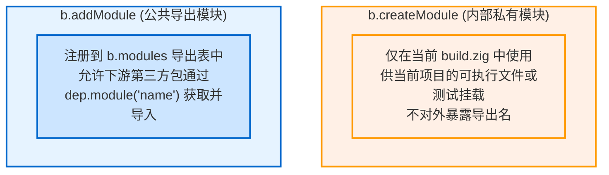

# 模块组织与命名空间：createModule、addModule 与 addImport

在 Zig 中，模块之间的导入关系通过模块导入表（Import Table）管理，而不是直接依赖物理路径相对引用。

---

## 1. 私有模块 vs 公共导出模块

在构建脚本中创建模块主要有两个 API：



### 1.1 `b.createModule`
用于项目内部组件的组装：
```zig
// 创建供内部可执行文件使用的私有模块
const internal_mod = b.createModule(.{
    .root_source_file = b.path("src/internal_helper.zig"),
    .target = target,
    .optimize = optimize,
});
```

### 1.2 `b.addModule`
用于将模块暴露给外部下游依赖消费：
```zig
// 注册公开导出的模块
const pub_mod = b.addModule("my_lib", .{
    .root_source_file = b.path("src/root.zig"),
    .target = target,
    .optimize = optimize,
});
```
当第三方项目通过 `build.zig.zon` 引入当前包后，在其 `build.zig` 中即可通过名字获取该模块：
```zig
const dep = b.dependency("my_pkg", .{ ... });
const mod = dep.module("my_lib"); // 对应 addModule("my_lib", ...)
```

---

## 2. 模块命名空间映射：`addImport`

在 Zig 源码中：
```zig
const engine = @import("engine");
```
这里的 `"engine"` 是当前模块符号导入表（`import_table`）中的别名，而不是物理文件名。

在 `build.zig` 中，通过 `mod.addImport(alias, target_mod)` 显式建立关联：

```zig
// 模块 A：核心逻辑
const core_mod = b.createModule(.{
    .root_source_file = b.path("src/core.zig"),
    .target = target,
    .optimize = optimize,
});

// 模块 B：主应用
const app_mod = b.createModule(.{
    .root_source_file = b.path("src/main.zig"),
    .target = target,
    .optimize = optimize,
});

// 建立依赖映射：允许 app_mod 源码中使用 @import("engine") 引用 core_mod
app_mod.addImport("engine", core_mod);
```

### 机制特点：
1. **依赖隔离**：模块 A 内部引入的依赖不会隐式泄漏给模块 B，模块 B 需要显式声明导入；
2. **支持自定义命名**：下游可以根据本地语义为引入的模块命名（例如将第三方包映射为 `@import("json")`）。
