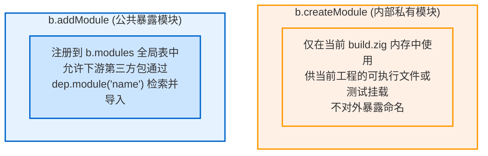

# 模块组织与命名空间：createModule、addModule 与 addImport

在 Zig 中，源码文件并不是通过物理文件系统的层级直接相互导入的，而是通过**模块命名空间图（Module Import Table）**进行严格隔离与组织的。

---

## 1. 私有模块 vs 公共导出模块

在构建脚本中创建模块主要有两个核心 API：



### 1.1 `b.createModule`
用于工程内部组件的组装：
```zig
// Create private module for internal executable
const internal_mod = b.createModule(.{
    .root_source_file = b.path("src/internal_helper.zig"),
    .target = target,
    .optimize = optimize,
});
```

### 1.2 `b.addModule`
用于将当前工程作为依赖库提供给外部开发者使用：
```zig
// Register public module for downstream consumers
const pub_mod = b.addModule("my_awesome_lib", .{
    .root_source_file = b.path("src/root.zig"),
    .target = target,
    .optimize = optimize,
});
```
当第三方项目通过 `build.zig.zon` 引入你的库后，在它的 `build.zig` 中便可以通过：
```zig
const dep = b.dependency("my_pkg", .{ ... });
const mod = dep.module("my_awesome_lib"); // 命中 addModule 导出的名字
```

---

## 2. 模块命名空间映射：`addImport`

在 Zig 源码中：
```zig
const helper = @import("helper");
```
这里的 `"helper"` **不是磁盘上的相对文件名**，而是当前模块的符号导入表（`import_table`）中的别名。

在 `build.zig` 中，我们通过 `mod.addImport(alias, target_mod)` 显式建立关联：

```zig
// Module A: Core logic
const core_mod = b.createModule(.{
    .root_source_file = b.path("src/core.zig"),
    .target = target,
    .optimize = optimize,
});

// Module B: Main App
const app_mod = b.createModule(.{
    .root_source_file = b.path("src/main.zig"),
    .target = target,
    .optimize = optimize,
});

// Wire dependency: Allow app_mod to @import("engine")
app_mod.addImport("engine", core_mod);
```

### 优势与设计原则：
1. **防止符号污染**：模块 A 内部引入的依赖，不会无感知地泄漏给模块 B，除非模块 B 也显式添加了对应的导入；
2. **灵活重命名**：下游可以根据需要将任何上游模块重命名为符合本地语义的名称（如将 `zig-json` 导入为 `@import("json")`）。
