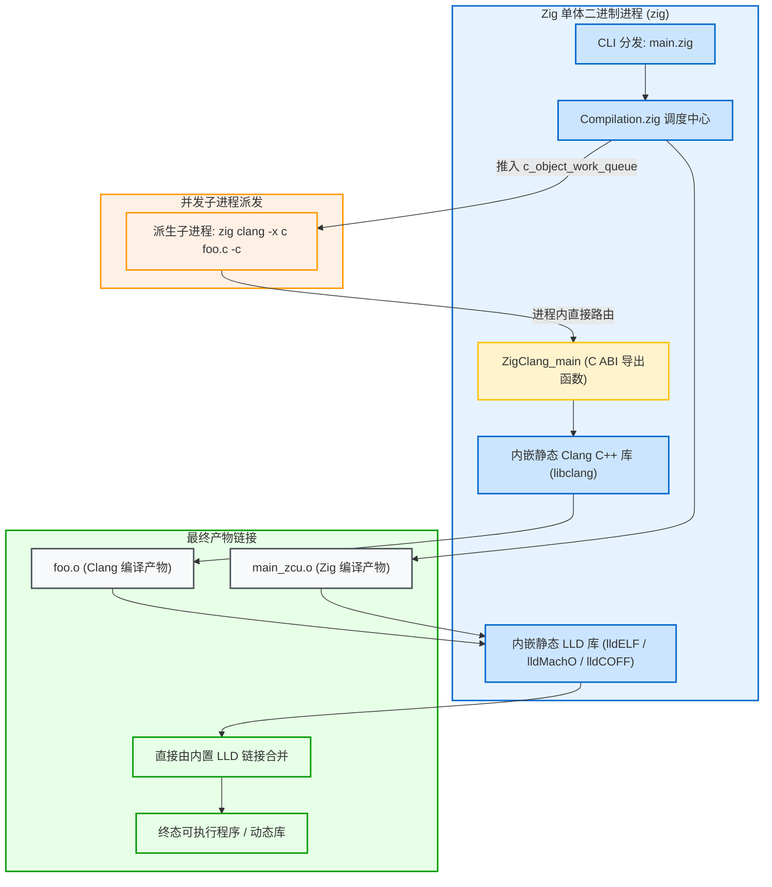

# 内置 C 工具链：嵌入式 Clang 与 LLD 桥接

在系统级构建中，最令人惊叹的特性之一是：**只要你安装了 Zig，你就拥有了一个完全自包含、能够无痛交叉编译 C/C++ 代码的完整工业级编译器工具链**。

这一神奇能力的底层秘密，正是 Zig 源码中对 Clang 编译器与 LLD 链接器的深度内嵌。

---

## 1. 架构总览：单体二进制中的 C 工具链



---

## 2. 源码级解析：C++ FFI 桥接机制

Zig 官方在编译 `zig` 编译器自身时，直接将 LLVM、Clang 和 LLD 编译为静态库链接进单体程序中。两者通过标准的 C ABI 进行桥接：

### 2.1 Zig 侧声明：[src/main.zig](https://codeberg.org/ziglang/zig/src/tag/0.16.0/src/main.zig#L5981)
```zig
// In src/main.zig
extern "c" fn ZigClang_main(argc: c_int, argv: [*:null]?[*:0]u8) c_int;
```

### 2.2 C++ 侧导出：[src/zig_clang_driver.cpp](https://codeberg.org/ziglang/zig/src/tag/0.16.0/src/zig_clang_driver.cpp#L467)
```cpp
// In src/zig_clang_driver.cpp
extern "C" int ZigClang_main(int argc, char **argv) {
    return clang_main(argc, argv, {argv[0], nullptr, false});
}
```

当 `zig clang` 命令被触发时，Zig 根本不会在外部磁盘上去寻找 `clang` 可执行文件，而是通过 `ZigClang_main` 直接调用已经驻留在当前进程内存中的 Clang 前端引擎！

---

## 3. 并发 C 编译工作队列：`c_object_work_queue`

当构建图中包含大量 C 源文件时，[src/Compilation.zig](https://codeberg.org/ziglang/zig/src/tag/0.16.0/src/Compilation.zig) 会启动专用的并发编译工作队列：

```zig
// src/Compilation.zig
for (comp.c_object_table.keys()) |c_object| {
    comp.c_object_work_queue.pushBackAssumeCapacity(c_object);
}
```

- 编译线程池并行从 `c_object_work_queue` 中弹出待编译的 C 文件；
- 拼装参数调用 `self_exe_path`（即 `zig` 自身）派生 `zig clang` 子进程；
- 生成的目标文件（`lib.c.o`）直接写入 `.zig-cache/o/` 的哈希隔离目录下。

---

## 4. 为什么 Zig 与 Clang 编译出的 `.o` 能够完美无缝合并？

很多混合编程语言在链接外部 C 目标文件时都需要编写胶水层转换，为什么 Zig 可以直接链接？

1. **完全一致的 ABI 遵循**：
   Zig 的函数调用约定原生对齐各大操作系统的标准 C ABI（如 Linux x86_64 的 System V AMD64 ABI，Windows 的 MSVC x64 ABI，以及 ARM 的 AAPCS64）；
2. **完全同构的目标文件格式**：
   Zig 生成的 `main_zcu.o` 与 Clang 编译出的 `c_lib.o` 在结构上没有任何区别——它们都符合标准 ELF、Mach-O 或 COFF 规范，拥有标准的 `.text` 指令段、`.data` 数据段以及重定位符号表；
3. **内嵌 LLD 链接器统一处理**：
   Zig 内嵌的 LLD 链接器在最终阶段将 Zig 目标文件与 C 目标文件一视同仁，统一执行符号解析与地址重定位，直接输出单一的精炼二进制。
