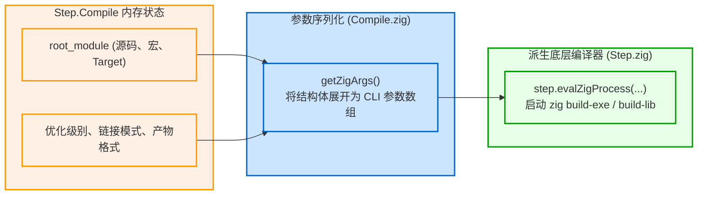

# 编译器交接：Step.Compile 到子进程拼装

在构建执行期，最重要也是最消耗 CPU 资源的节点莫过于负责编译的 `Step.Compile`。它是如何将构建脚本中的高层配置转化为具体的编译器调用的？

---

## 1. 核心流程：参数序列化与子进程派生

当调度线程池运转到某个未命中的 `Step.Compile` 节点时，触发其内部的 `makeFn`（即 `Step.Compile.make`）：



---

## 2. 源码深度剖析：`getZigArgs()`

在 [lib/std/Build/Step/Compile.zig](https://codeberg.org/ziglang/zig/src/tag/0.16.0/lib/std/Build/Step/Compile.zig) 中，`Step.Compile.make()` 首先调用 `getZigArgs()`：

1. **确定子命令类别**：
   根据产物类型（可执行文件、库、测试）确定底层的 Zig CLI 命令：
   - 可执行文件 -> `zig build-exe`
   - 库文件 -> `zig build-lib`
   - 目标文件 -> `zig build-obj`
2. **模块与依赖树平铺**：
   遍历根模块及其引用的所有子模块，使用命令行参数语法进行编码：
   - `-Mroot=src/main.zig`：定义主入口模块；
   - `-Mhelper=src/helper.zig`：定义子模块；
   - `--dep helper`：在根模块与子模块之间声明依赖桥接；
3. **C 源码与头文件包含参数注入**：
   - `-I path/to/include`：注入头文件路径；
   - `-DNAME=VALUE`：注入预处理宏；
   - 将绑定的所有 `.c`、`.cpp` 文件路径追加到命令行尾部。

### 实战还原：底层 CLI 命令示例

对于一个同时包含 Zig 源码、子模块与 C 语言文件的项目，`getZigArgs()` 组装出的最终命令行大致如下：

```bash
zig build-exe \
  --name my_app \
  -target aarch64-macos-none \
  -O ReleaseFast \
  -Mroot=src/main.zig \
  -Mengine=src/engine.zig \
  --dep engine \
  -I include \
  -DHAVE_CONFIG_H=1 \
  src/native_helper.c \
  --cache-dir .zig-cache \
  --listen=-
```

随后，[lib/std/Build/Step.zig](https://codeberg.org/ziglang/zig/src/tag/0.16.0/lib/std/Build/Step.zig) 中的 `step.evalZigProcess` 通过 IPC 管道启动 `zig` 编译器主进程执行实际编译。

这种“高层构建系统向低层编译器下发标准化 CLI 命令”的设计，不仅使构建运行器与编译器实现逻辑解耦，也使得任何编译故障都可以直接通过纯终端命令行独立重现与调试。
