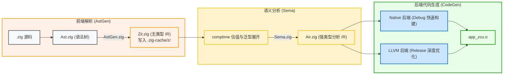

# 编译单元：ZCU (Zig Compilation Unit) 与单体编译

在 `.zig-cache/o/` 目录中经常能看到类似 `example_zcu.o` 或 `build_zcu.o` 的目标文件。这里的 **ZCU** 即 **Zig Compilation Unit（Zig 编译单元）**，是 Zig 编译器组织和分析源代码的核心单元。

---

## 1. 架构对比：C 传统编译 vs Zig ZCU 单体编译

在传统的 C/C++ 项目中，编译器采用**分离编译模型（Separate Compilation）**：

```mermaid
graph TD
    subgraph S_C ["C/C++ 分离编译模型"]
        C1["a.c"] --> O1["a.o"]
        C2["b.c"] --> O2["b.o"]
        C3["c.c"] --> O3["c.o"]
        O1 --> Link_C["链接器 (Linker)"]
        O2 --> Link_C
        O3 --> Link_C
        Link_C --> Bin_C["最终可执行文件"]
    end

    subgraph S_Zig ["Zig ZCU 单体编译模型"]
        Z1["main.zig"]
        Z2["core.zig"]
        Z3["math.zig"]
        ZCU["统一编译分析单元 (ZCU: src/Zcu.zig)<br/>- 跨模块 comptime 求值<br/>- 跨模块泛型单态化展开<br/>- 全局死代码消除 (DCE)"]
        Z1 --> ZCU
        Z2 --> ZCU
        Z3 --> ZCU
        ZCU --> Obj_Zig["单体目标文件 (app_zcu.o)"]
        Obj_Zig --> Link_Z["链接器 (Linker)"]
        Link_Z --> Bin_Z["最终可执行文件"]
    end

    classDef default fill:#f8f9fa,stroke:#495057;
    style S_C fill:#fff0e6,stroke:#ff9900,stroke-width:2px;
    style S_Zig fill:#e6f3ff,stroke:#0066cc,stroke-width:2px;
    style C1 fill:#f8f9fa,stroke:#495057,stroke-width:2px;
    style C2 fill:#f8f9fa,stroke:#495057,stroke-width:2px;
    style C3 fill:#f8f9fa,stroke:#495057,stroke-width:2px;
    style O1 fill:#f8f9fa,stroke:#495057,stroke-width:2px;
    style O2 fill:#f8f9fa,stroke:#495057,stroke-width:2px;
    style O3 fill:#f8f9fa,stroke:#495057,stroke-width:2px;
    style Link_C fill:#cce5ff,stroke:#0066cc,stroke-width:2px;
    style Bin_C fill:#e6ffe6,stroke:#009900,stroke-width:2px;
    style Z1 fill:#f8f9fa,stroke:#495057,stroke-width:2px;
    style Z2 fill:#f8f9fa,stroke:#495057,stroke-width:2px;
    style Z3 fill:#f8f9fa,stroke:#495057,stroke-width:2px;
    style ZCU fill:#cce5ff,stroke:#0066cc,stroke-width:2px;
    style Obj_Zig fill:#fff3cd,stroke:#ffc107,stroke-width:2px;
    style Link_Z fill:#cce5ff,stroke:#0066cc,stroke-width:2px;
    style Bin_Z fill:#e6ffe6,stroke:#009900,stroke-width:2px;
```

### 为什么 Zig 采用类似 Unity Build 的 ZCU 模型？
1. **全局跨模块 `comptime`**：
   Zig 中的泛型通过 `comptime` 函数返回类型实现。模块间传递编译期参数并按需生成类型，要求语义分析器（Sema）具备全项目范围的类型推导与感知能力；
2. **跨模块死代码消除（DCE）**：
   在 ZCU 中，只有真正被调用的函数和被引用的类型才会进入语义分析与机器码生成，未使用的符号会被直接裁剪，无需完全依赖链接阶段的 LTO（Link-Time Optimization）；
3. **跨模块内联优化**：
   函数内联不受单源文件边界限制，编译器可以对完整调用链路进行优化。

同一个构建目标引用的所有 Zig 模块，最终由编译器统一输出为**单个目标文件（如 `app_zcu.o`）**。

---

## 2. 编译中间表示（IR）管线解析

从 `.zig` 源码到目标文件，编译流程分为以下环节：

1. **AST（抽象语法树）**：
   位于 [lib/std/zig/Ast.zig](https://codeberg.org/ziglang/zig/src/tag/0.16.0/lib/std/zig/Ast.zig)，采用扁平化的 `MultiArrayList` 结构，提供高效的缓存局部性；
2. **ZIR（Zig Intermediate Representation）**：
   位于 [lib/std/zig/Zir.zig](https://codeberg.org/ziglang/zig/src/tag/0.16.0/lib/std/zig/Zir.zig)。它是**无类型的平铺指令序列**，每个 `.zig` 文件独立生成一个 ZIR，并在生成后直接序列化存放在 `.zig-cache/z/` 中，供增量构建复用；
3. **AIR（Analyzed Intermediate Representation）**：
   位于 [src/Air.zig](https://codeberg.org/ziglang/zig/src/tag/0.16.0/src/Air.zig)。语义分析器消费 ZIR 并执行完所有 `comptime` 估值后，输出带有完全确定类型与控制流图的 AIR；
4. **后端选择（Native vs LLVM）**：
   - **Native 后端**：在 Debug 模式下，Zig 可以直接将 AIR 翻译为目标架构机器码，绕过 LLVM IR 生成环节，缩短构建耗时；
   - **LLVM 后端**：在 Release 模式下，Zig 将 AIR 转换为 LLVM IR，调用 LLVM 优化器与后端生成更高执行效率的机器码。
