# 实战二：Zig 与 C/C++ 混合编程工程结构

在工业级系统研发中，很少有完全“绿地开发”的场景。更多时候我们需要在现有 C/C++ 代码库的基础上使用 Zig 进行渐进式重构或功能扩展。

---

## 1. 混合工程标准目录

```text
mixed-project/
├── build.zig
├── build.zig.zon
├── c_include/
│   └── native_math.h     # C 公共头文件
├── c_src/
│   └── native_math.c     # 现有 C 源码实现
└── src/
    └── main.zig          # Zig 业务入口
```

---

## 2. 方式对比：手写 `extern` vs `addTranslateC` 自动化

```mermaid
graph TD
    subgraph S_Hand ["方式 A：手写 extern 声明 (适合 C 接口极少)"]
        H_C["native_math.c"]
        H_Zig["main.zig: extern fn add(a: c_int, b: c_int) c_int;"]
        H_C -. "二进制符号链接" .-> H_Zig
    end

    subgraph S_Auto ["方式 B：addTranslateC 自动转译 (推荐，无维护成本)"]
        A_H["native_math.h"]
        A_TC["b.addTranslateC()"]
        A_Mod["自动生成 Zig 类型与函数 Module"]
        A_Main["main.zig: const math = @import('native_math');"]
        A_H --> A_TC
        A_TC --> A_Mod
        A_Mod --> A_Main
    end

    classDef default fill:#f8f9fa,stroke:#495057;
    style S_Hand fill:#fff0e6,stroke:#ff9900,stroke-width:2px;
    style S_Auto fill:#e6f3ff,stroke:#0066cc,stroke-width:2px;
    style H_C fill:#fff0e6,stroke:#ff9900,stroke-width:2px;
    style H_Zig fill:#fff3cd,stroke:#ffc107,stroke-width:2px;
    style A_H fill:#fff0e6,stroke:#ff9900,stroke-width:2px;
    style A_TC fill:#cce5ff,stroke:#0066cc,stroke-width:2px;
    style A_Mod fill:#e6ffe6,stroke:#009900,stroke-width:2px;
    style A_Main fill:#f8f9fa,stroke:#495057,stroke-width:2px;
```



---

## 3. 标准 `build.zig` 实现（采用自动转译方案）

```zig
const std = @import("std");

pub fn build(b: *std.Build) void {
    const target = b.standardTargetOptions(.{});
    const optimize = b.standardOptimizeOption(.{});

    // 1. Step 1: Translate C header file into a Zig Module
    const translate_c = b.addTranslateC(.{
        .root_source_file = b.path("c_include/native_math.h"),
        .target = target,
        .optimize = optimize,
    });
    translate_c.addIncludePath(b.path("c_include"));
    const math_c_module = translate_c.createModule();

    // 2. Step 2: Create main Zig executable module with C source attached
    const exe_module = b.createModule(.{
        .root_source_file = b.path("src/main.zig"),
        .target = target,
        .optimize = optimize,
        .link_libc = true, // Must enable libc linking when compiling C sources!
        .imports = &.{
            .{ .name = "native_math", .module = math_c_module },
        },
    });

    // Attach C source files to exe_module
    exe_module.addCSourceFile(.{
        .file = b.path("c_src/native_math.c"),
        .flags = &.{"-Wall", "-Wextra", "-O3"},
    });
    exe_module.addIncludePath(b.path("c_include"));

    // 3. Step 3: Build and install executable
    const exe = b.addExecutable(.{
        .name = "mixed_app",
        .root_module = exe_module,
    });
    b.installArtifact(exe);
}
```

---

## 4. 业务代码调用（`src/main.zig`）

在 `main.zig` 中，无需手写任何 C 结构体或函数原型映射，直接享受强类型智能提示：

```zig
const std = @import("std");
// Directly import the translated C header module!
const math = @import("native_math");

pub fn main() void {
    const sum = math.native_add(40, 2);
    std.debug.print("Computed from C: {}\n", .{sum});
}
```
整个流程由 Zig 内置的 Clang 与 LLD 全自动并发编译与链接，无论是 Linux、macOS 还是 Windows，均可直接一条命令完成构建。
