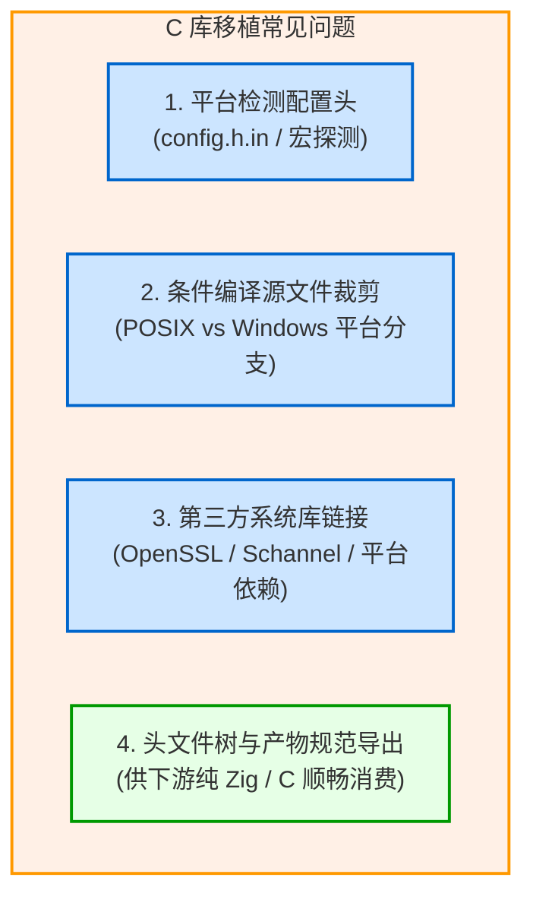

# 实战三：复杂第三方 C 库的完整移植实践（以 MariaDB Connector 为例）

移植单文件 C 代码通常较为直接，但主流 C 库（如 MariaDB Connector/C、SQLite、OpenSSL 等）通常包含较多源码文件、CMake 配置探测、平台条件编译分支以及第三方依赖。

本章以开源项目 [zig-mariadb-connector](https://github.com/jiacai2050/zig-mariadb-connector) 为例，梳理移植成熟 C 库到 Zig 构建系统的实践流程。关于社区常用 C 库的封装案例，也可以参考 [All Your Codebase](https://github.com/allyourcodebase/)。

---

## 1. 移植面临的核心挑战

大型 C 库的构建脚本通常包含以下四个核心难题：



---

## 2. 移植核心步骤拆解

### 第一步：零侵入管理 Upstream 源码
推荐保持上游代码仓库的纯净，通过 `b.dependency("upstream", ...)` 或特定子目录引入，不修改上游任何源码文件。

### 第二步：使用 `addConfigHeader` 替代 CMake 探测
MariaDB Connector 依赖 `include/config.h.in`。在 Zig 构建中，我们通过 `b.addConfigHeader` 并结合目标平台信息直接计算宏值：

```zig
const target_is_windows = target.result.os.tag == .windows;

const config_h = b.addConfigHeader(
    .{
        .style = .{ .cmake = upstream.path("include/config.h.in") },
        .include_path = "config.h",
    },
    .{
        .HAVE_STDDEF_H = true,
        .HAVE_STDINT_H = true,
        .HAVE_SYS_TYPES_H = true,
        .HAVE_UNISTD_H = !target_is_windows,
        .HAVE_PTHREAD = !target_is_windows,
        .SIZEOF_SIZE_T = @as(i64, target.result.ptrBitWidth() / 8),
        .DEFAULT_CHARSET = "utf8mb4",
        .MARIADB_PORT = 3306,
        .MARIADB_UNIX_ADDR = "/tmp/mysql.sock",
    },
);
```

### 第三步：按目标操作系统分拣源文件
根据操作系统分支，精准组织需要参与编译的 `.c` 源文件列表：

```zig
const common_sources = &.{
    "libmariadb/ma_client_plugin.c",
    "libmariadb/mariadb_charset.c",
    "libmariadb/mariadb_lib.c",
    "libmariadb/ma_time.c",
    "libmariadb/ma_default.c",
    "libmariadb/ma_errmsg.c",
};

const posix_sources = &.{
    "libmariadb/secure/openssl.c",
};

const windows_sources = &.{
    "libmariadb/secure/schannel.c",
};

// Add to module based on OS
c_module.addCSourceFiles(.{
    .root = upstream.path(""),
    .files = common_sources,
    .flags = c_flags,
});

if (target_is_windows) {
    c_module.addCSourceFiles(.{
        .root = upstream.path(""),
        .files = windows_sources,
        .flags = c_flags,
    });
} else {
    c_module.addCSourceFiles(.{
        .root = upstream.path(""),
        .files = posix_sources,
        .flags = c_flags,
    });
}
```

### 第四步：静态库构建与公共头文件树导出
上游导出的静态库必须同时提供完整的头文件树：

```zig
const lib = b.addLibrary(.{
    .name = "mariadb",
    .linkage = .static,
    .root_module = c_module,
});

// 1. Install static headers from upstream include directory
lib.installHeadersDirectory(upstream.path("include"), "mariadb", .{});

// 2. Install dynamically rendered configuration header
lib.installConfigHeader(config_h);

// 3. Expose library artifact
b.installArtifact(lib);
```

### 第五步：编写集成测试套件验证交付
在工程下建立独立的 `test/` 子工程，通过 `b.dependency("zig-mariadb-connector", ...)` 引入刚才构建的库产物，执行真实的 MySQL/MariaDB 握手与句柄初始化测试，确保跨平台符号与 ABI 完全兼容。

---

## 3. 经验总结

移植 C 库的关键在于理清源码结构、配置宏生成逻辑以及依赖关系。将 CMakeLists.txt 转写为 `build.zig` 后，可以在不依赖额外构建工具（如 CMake、Make）的前提下，实现统一的跨平台交叉编译与分发。
