# 实战二：Zig 与 C/C++ 混合编程工程结构

在实际开发中，常常需要在现有 C/C++ 代码库的基础上集成 Zig，或者使用 Zig 逐步替换旧模块。

> 💡 **配套可运行示例**
> 本章对应的完整独立工程代码位于 GitHub：[`examples/02-mixed-c-zig`](https://github.com/jiacai2050/x/tree/main/zig-build/examples/02-mixed-c-zig)。
> 你可以进入该目录并通过以下命令体验 Zig 与 C 混合编译及头文件自动转译：
> ```bash
> cd examples/02-mixed-c-zig
> zig build run
> ```

---

## 1. 混合工程标准目录

```text
mixed-project/
├── build.zig
├── build.zig.zon
├── c_include/
│   └── native_math.h     # C 公共头文件
├── c_src/
│   └── native_math.c     # 现有 C 源码实现
└── src/
    └── main.zig          # Zig 业务入口
```

---

## 2. 方式对比：手写 `extern` vs `addTranslateC` 自动化

```mermaid
graph TD
    subgraph S_Hand ["方式 A：手写 extern 声明 (适合 C 接口极少)"]
        H_C["native_math.c"]
        H_Zig["main.zig: extern fn add(a: c_int, b: c_int) c_int;"]
        H_C -. "二进制符号链接" .-> H_Zig
    end

    subgraph S_Auto ["方式 B：addTranslateC 自动转译 (适合多数接口场景)"]
        A_H["native_math.h"]
        A_TC["b.addTranslateC()"]
        A_Mod["自动生成 Zig 类型与函数 Module"]
        A_Main["main.zig: const math = @import('native_math');"]
        A_H --> A_TC
        A_TC --> A_Mod
        A_Mod --> A_Main
    end

    classDef default stroke:#495057;
    style S_Hand stroke:#ff9900,stroke-width:2px;
    style S_Auto stroke:#0066cc,stroke-width:2px;
    style H_C stroke:#ff9900,stroke-width:2px;
    style H_Zig stroke:#ffc107,stroke-width:2px;
    style A_H stroke:#ff9900,stroke-width:2px;
    style A_TC stroke:#0066cc,stroke-width:2px;
    style A_Mod stroke:#009900,stroke-width:2px;
    style A_Main stroke:#495057,stroke-width:2px;
```



---

## 3. 标准 `build.zig` 实现（采用自动转译方案）

```zig
const std = @import("std");

pub fn build(b: *std.Build) void {
    const target = b.standardTargetOptions(.{});
    const optimize = b.standardOptimizeOption(.{});

    // 1. Step 1: Translate C header file into a Zig Module
    const translate_c = b.addTranslateC(.{
        .root_source_file = b.path("c_include/native_math.h"),
        .target = target,
        .optimize = optimize,
    });
    translate_c.addIncludePath(b.path("c_include"));
    const math_c_module = translate_c.createModule();

    // 2. Step 2: Create main Zig executable module with C source attached
    const exe_module = b.createModule(.{
        .root_source_file = b.path("src/main.zig"),
        .target = target,
        .optimize = optimize,
        .link_libc = true, // Must enable libc linking when compiling C sources!
        .imports = &.{
            .{ .name = "native_math", .module = math_c_module },
        },
    });

    // Attach C source files to exe_module
    exe_module.addCSourceFile(.{
        .file = b.path("c_src/native_math.c"),
        .flags = &.{"-Wall", "-Wextra", "-O3"},
    });
    exe_module.addIncludePath(b.path("c_include"));

    // 3. Step 3: Build and install executable
    const exe = b.addExecutable(.{
        .name = "mixed_app",
        .root_module = exe_module,
    });
    b.installArtifact(exe);
}
```

---

## 4. 业务代码调用（`src/main.zig`）

在 `main.zig` 中，直接导入转译后的模块即可调用 C 函数：

```zig
const std = @import("std");
// Directly import the translated C header module!
const math = @import("native_math");

pub fn main() void {
    const sum = math.native_add(40, 2);
    std.debug.print("Computed from C: {}\n", .{sum});
}
```

编译时由 Zig 内置的 Clang 和 LLD 处理 C 源码与目标文件链接，跨平台保持统一的构建命令。

---

## 5. 注意事项与进阶要点

1. **混编 C++ 源码时调用 `linkLibCpp()`**：
   若工程中混编了 `.cpp` 源文件，仅开启 `.link_libc = true` 会在链接阶段报缺失 C++ 运行时符号（如 `operator new`）。此时需在模块上调用：
   ```zig
   exe_module.linkLibCpp();
   ```
   Zig 会自动链接目标平台对应的 C++ 标准库；
2. **C 头文件中的 `static inline` 函数**：
   对于简单的 `static inline` 函数，`translate-c` 可以自动转译为 Zig 内联函数。若函数体内使用了未受支持的编译器扩展宏或内联汇编，转译可能会报错。此时建议在 `.c` 文件中将其重新封装为常规的 `extern` 函数。
